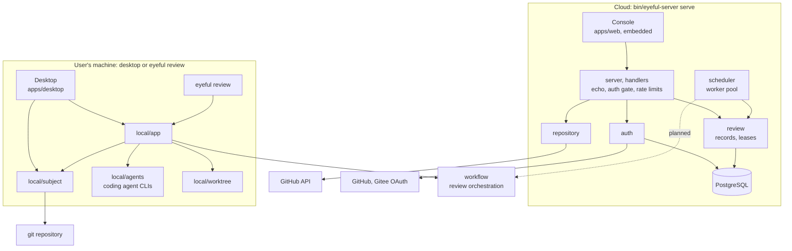
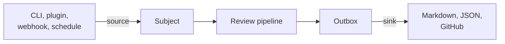
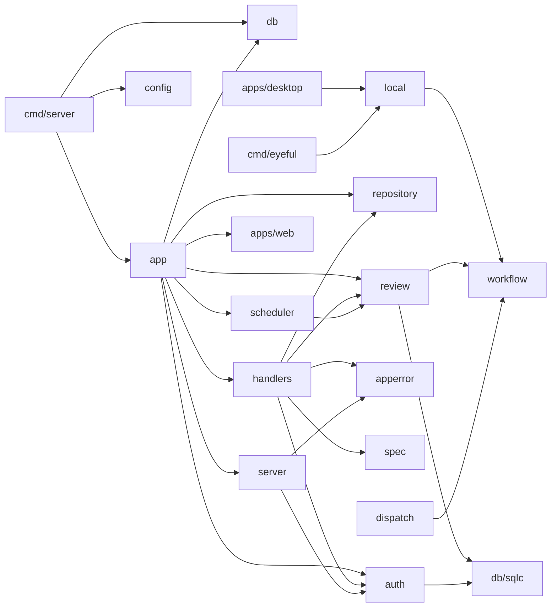
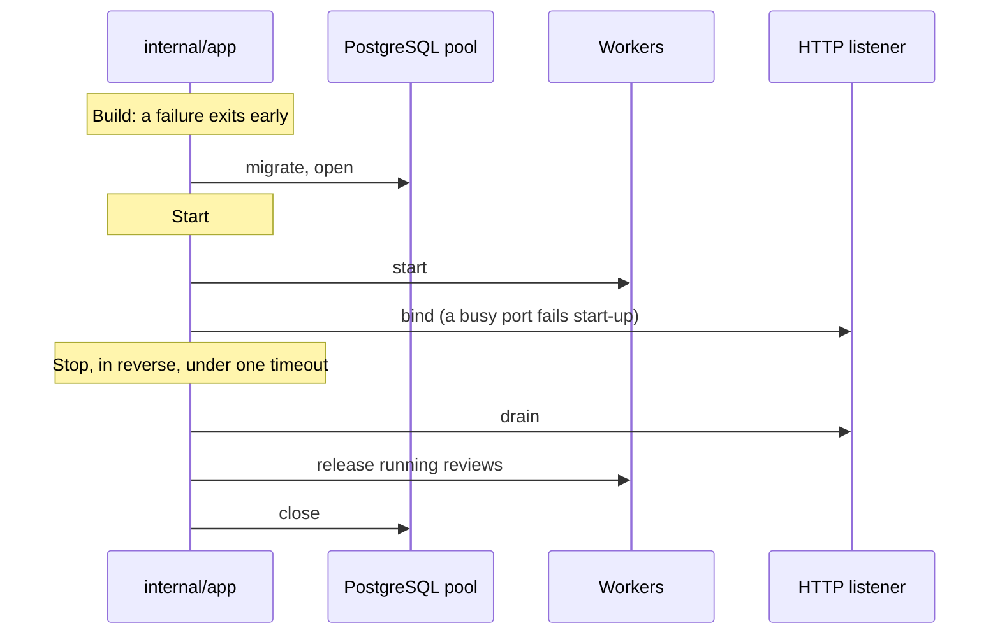

# Architecture

This page covers how eyeful's code is organised, which way dependencies point, and how the process
starts and stops. What eyeful does with a change is described in [A review](REVIEW.md) and the pages
after it.

eyeful has a cloud side and a local side, and both use the same review workflow. The cloud server,
`eyeful-server`, is one Go binary with the console, the migrations and the API document embedded,
and its only dependency is PostgreSQL. The local side is the desktop app and the `eyeful` command,
which run without a server. Each binary contains only its own side's code, and the two sides
exchange no data.

## Components

Dashed edges are planned.

In the cloud, the console is a static SvelteKit app served by the same binary. A request passes
through `server` (authentication and rate limits) to `handlers`, which translate HTTP and call the
domain packages: `auth` for accounts and credentials, `review` for review records and leases, and
`repository` for reading GitHub with the signed-in user's token. The `scheduler` runs workers that
claim queued reviews from PostgreSQL. The workers still end each review with a placeholder executor:
`workflow` exists, but the pi runtime and the sandbox it needs from the cloud side do not.

On the user's machine, the desktop app is a window over what the CLI does: it calls the same
`local` packages: `local/subject` to show the changes, and `local/app` for the agents and the
review, whose log and confirmation reach the window as Wails events. Neither it nor the CLI ever reaches the cloud server or
PostgreSQL. `eyeful review` goes through `local/app`, which reads the change
with `local/subject`, checks out the snapshot with `local/worktree` for `execution`, and runs `workflow` with the
user's coding agent CLIs through `local/agents` ([Running locally](LOCAL.md)). `workflow` is the only code the two sides
share.

## The review workflow {#workflow}

`workflow` runs one review from the CI check to the comments, in the stages of
[A review](REVIEW.md#stages). It runs no agent, no command and no storage itself. The caller passes
three interfaces in a `Session`, and each side of eyeful supplies its own:

| Interface   | Provides                                                                                                                                       | Cloud                          | Local                                     |
| ----------- | ---------------------------------------------------------------------------------------------------------------------------------------------- | ------------------------------ | ----------------------------------------- |
| `Agents`    | One call per role: diagnose CI, plan, review as an expert, fix, judge, summarize. Each returns its typed result and the tokens and money spent | pi processes (planned)         | CLI runs, `local/agents`                  |
| `Workspace` | The CI check, `setup`, the L1 tools, and test runs on a fresh copy with given edits applied                                                    | The review's sandbox (planned) | The snapshot's checkout, `local/worktree` |
| `Archive`   | Loading and saving each stage's output by key                                                                                                  | The run archive (planned)      | `.eyeful/runs/`, `local/archive`          |

Go owns every loop. `workflow` checks each plan, report and summary against its rules, keeps the
budget, decides retries and when to stop, and saves each stage's output to the archive before the
next one starts, so a resumed review repeats no finished agent call. The expert roster (names, tiers,
skills, evidence kinds) is passed to `workflow.New`. `workflow/prompts` holds what agents are given:
the expert and role prompts, the tool definitions and which role gets which tools, the vendored
skills, and how each task becomes a prompt, so the cloud and local agents are given the same text;
`workflow/project` reads `.eyeful/config.yml` for both sides; `workflow/report` renders a result as Markdown and SARIF. `workflow` has no fx, no database
and no server types; its dependencies are widely used libraries for globs, diffs, YAML and SARIF. `workflow.SplitPatch` turns
`git diff` output into the files of a change, for both sides.

## Languages

Go is used for the server, the CLI, the review workflow, scheduling, sandboxes, GitHub access and
the REST API, built as two binaries: the server and the local CLI. TypeScript is used for the console, the desktop frontend and the pi
extension, with HTTP types generated from the spec. Python is used only for the evaluation. Agents
run in pi in the cloud and in the user's coding agent CLIs locally; eyeful has no agent loop of
its own.

## Layout {#layout}

### Modules

The shared code and the local code are separate Go modules at the repository root, so the compiler
enforces the boundary between them ([Running locally](LOCAL.md), [Running in the cloud](CLOUD.md)):

| Module     | Holds                                            | May import          | Used by                      |
| ---------- | ------------------------------------------------ | ------------------- | ---------------------------- |
| `workflow` | Subagent orchestration and its interfaces        | nothing here        | `local`, `internal`          |
| `local`    | Local capabilities the CLI and the desktop share | `workflow`          | `cmd/eyeful`, `apps/desktop` |
| root       | `cmd/` (both binaries), `internal/` (the server) | `workflow`, `local` | `eyeful`, `eyeful-server`    |

`local/go.mod` does not require the root module, so local code cannot import the server even by
accident. Go links a binary only from what its `main` package imports: `cmd/eyeful` imports `local`
and `workflow` and nothing under `internal/`, and `cmd/server` imports nothing from `local`, so
neither binary contains the other side's code. The desktop app is a fourth module, described under Frontends.

### Directories

| Path                    | Owns                                                                                                                                                                                                     |
| ----------------------- | -------------------------------------------------------------------------------------------------------------------------------------------------------------------------------------------------------- |
| `cmd/eyeful`            | The local CLI (kong): `review`, `provider`, `connect`, `commit`                                                                                                                                          |
| `cmd/server`            | The server binary (kong): `serve`, `migrate`                                                                                                                                                             |
| `apps/web`              | Cloud console: SvelteKit, built to `dist/`, embedded by `embed.go`                                                                                                                                       |
| `apps/desktop`          | Local GUI over what `eyeful review` does: Wails v3, a separate Go module; `build/` holds packaging assets                                                                                                |
| `apps/desktop/frontend` | The desktop's SvelteKit frontend, built to `dist/` and embedded; Wails bindings in `bindings/`                                                                                                           |
| `packages/ui`           | shadcn-svelte components, diff view and file tree, theme, dark mode; strings come in as props                                                                                                            |
| `workflow`              | Review orchestration, a separate Go module: triage, plan check, experts, verifier, summary, budget, checkpoints                                                                                          |
| `workflow/prompts`      | Embedded expert and role prompts, tool definitions per role, the skills from skills.sh, and the prompt each role's task is turned into                                                                   |
| `workflow/project`      | `.eyeful/config.yml`: the project commands, `skip`, `risk`, and the digest a confirmation is kept under                                                                                                  |
| `workflow/report`       | A review result as Markdown and as SARIF 2.1.0                                                                                                                                                           |
| `local`                 | Local mode, a separate Go module: `subject` takes the snapshot of a local branch, commit or uncommitted changes                                                                                          |
| `local/app`             | Local composition root and the only package the CLI and the desktop call for actions: review, providers, connect, commit                                                                                 |
| `local/agents`          | `workflow.Agents` over the coding agents' own CLIs (claude, codex, pi), one process per call with read-only tools: sends the prompt from `workflow/prompts` on stdin and reads the result and usage back |
| `local/worktree`        | The snapshot's disposable checkout and `workflow.Workspace`: confirmed commands, edits, resets                                                                                                           |
| `local/store`           | The project's `.eyeful/runs/` directory, which git ignores, and the commands the user confirmed, kept outside the repository                                                                             |
| `local/settings`        | The connected agent and the desktop's last repository, in the user's settings file                                                                                                                       |
| `local/archive`         | Stage checkpoints as files under the run directory                                                                                                                                                       |
| `local/git`             | Runs git with a fixed environment for `subject`, `worktree` and `store`                                                                                                                                  |
| `local/tail`            | Keeps the last part of an agent's or a command's output                                                                                                                                                  |
| `internal/app`          | Cloud composition root: fx wiring and the lifecycle                                                                                                                                                      |
| `internal/config`       | The `Config` struct, filled by kong from flags and environment                                                                                                                                           |
| `internal/server`       | echo, middleware, authentication gate, rate limits, Problem rendering                                                                                                                                    |
| `internal/handlers`     | CRUD routes with swag annotations, one file per resource                                                                                                                                                 |
| `internal/apperror`     | Problem body and error codes                                                                                                                                                                             |
| `internal/auth`         | Users, sessions, API keys, GitHub App and Gitee sign-in, sealed provider tokens                                                                                                                          |
| `internal/repository`   | The signed-in user's GitHub repositories, read with their token: list, commit, tree, diff                                                                                                                |
| `internal/review`       | Review records and leases in PostgreSQL; `reviewtest` holds the memory store that tests use                                                                                                              |
| `internal/scheduler`    | Worker pool                                                                                                                                                                                              |
| `internal/dispatch`     | Provider routing for agent runs (not wired in yet)                                                                                                                                                       |
| `internal/db`, `db/`    | pgx pool, embedded migrations, SQL queries and sqlc output                                                                                                                                               |
| `spec/`, `packages/sdk` | Generated OpenAPI 3.1 document and TypeScript client                                                                                                                                                     |

Planned directories: `internal/checkout`, `internal/pi` and `internal/sandbox`; `internal/source`
and `internal/sink` (producers and consumers of reviews), `internal/outbox`, `plugins/` and
`eval/`.

Go commands live in `cmd/` and server code in `internal/`, following the official
[module layout](https://go.dev/doc/modules/layout).

### Frontends

The two frontends share components but not pages or state. The console makes only same-origin
requests: the server serves it for every path that matches no route, and `vp dev` proxies the API
paths to `EYEFUL_SERVER_URL`. It uses the hash router, so a console path such as `#/repositories`
cannot collide with the API route `/repositories`. The desktop frontend calls only its own Go
services, through the generated Wails bindings, and does not call the server. Because the desktop is
its own module, Wails and cgo stay out of the server build, and the server stays out of the desktop.

## Data flow {#data-flow}

A review moves through eyeful in one direction. Whatever requests a review (a producer) and whatever
receives the result (a consumer) are attached at the two ends, so adding either does not change the
pipeline.

Producers and consumers do not know about each other. Today the API admits reviews, and the
scheduler runs them with a placeholder executor that fails each one with a reason. Sources other
than the API, the outbox and the sinks are planned.

## Dependency direction {#dependency-direction}

An arrow means "imports". Dependencies point from the entry point inward to the domain packages and
the generated database code, and not back.

Handlers translate HTTP and contain no business rules or I/O. `server` knows nothing about
individual resources; it reads the bearer token and the session cookie and hands them to
`auth`, which does not see HTTP. `review` and `dispatch` take levels and tiers from `workflow`. Only `auth` and `review` call `db/sqlc`. `repository` gets tokens through an
interface that `auth` implements, so neither imports the other, and `app` connects them.

## Lifecycle {#lifecycle}

[fx](https://github.com/uber-go/fx) is the dependency injection container. Each mode has one
composition root, which is the only package in that mode that imports fx. For the cloud server it is
`internal/app`, which wires plain constructors into modules (`database`, `auth`, `review`,
`scheduler`, `http`) and owns every start and stop hook. For `eyeful review` it is `local/app`, which
has no long-running parts and wires plain constructors without fx.

Shutdown runs in reverse order: work in progress drains before the things it depends on stop, and
child processes exit before their work is released. TODO(sandbox): sandbox and agent processes join
the worker stop hook.

## Design decisions

1. The binary embeds what it needs: migrations, the spec and the console.
2. Packages follow the domain, and each owns its types (`types.go`), queries and rules.
3. Contracts are generated: annotations produce the spec, the spec produces the TypeScript client,
   and SQL produces Go. A hand-written wire type is a bug.
4. Every background task has an owner and a way to stop, and the lifecycle starts and stops it.
5. A failure affects only the unit that failed and records why: leases and fencing, cooldowns sized
   to the failure, retry decisions with reasons, and `Retry-After` on rate limits.
6. Waiting for capacity does not count as a failure, and output that has already been committed is
   not retried elsewhere.
7. PostgreSQL is the only database, because the queue relies on `SKIP LOCKED`.

Avoided on purpose: package-level state, goroutines without an owner, horizontal
controller/service/model layers, and hand-written CLI parsing.
