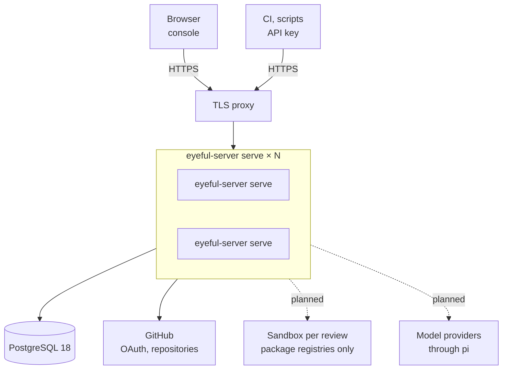
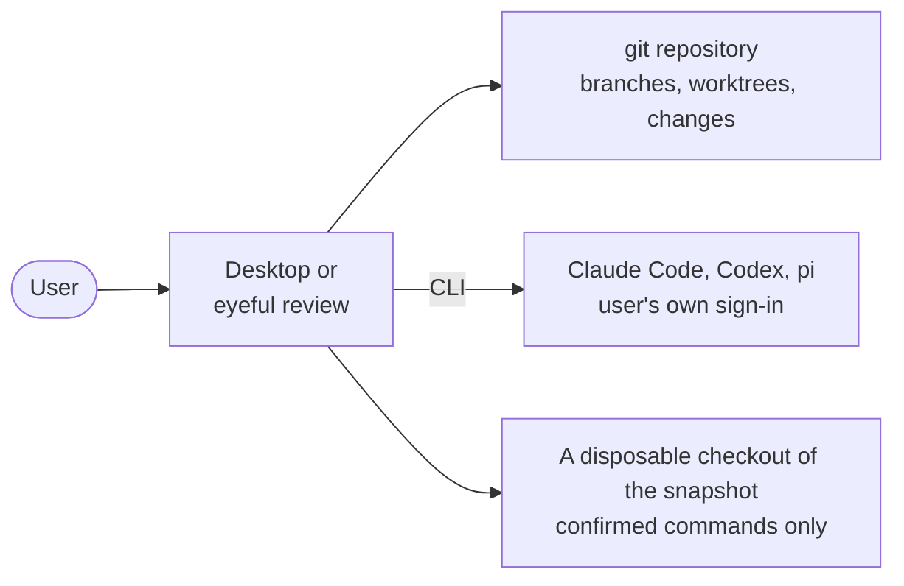

# Deployment

This page covers what eyeful ships, where each part runs, and what a production deployment needs.
Running eyeful from a checkout is in [Development](DEVELOPMENT.md), every variable is in
[Configuration](CONFIGURATION.md#server), and release timing is in the [Roadmap](ROADMAP.md).

A cloud deployment consists of the `eyeful-server serve` binary, a PostgreSQL 18 database, a TLS proxy, a
GitHub App and three secrets. To add capacity, run more copies of the binary against the same
database. The local side is the desktop app and the `eyeful` command, and needs no server. Nothing is published
until CI passes on it: the documentation site goes to GitHub Pages after each green CI run on `main`
(`docs.yml`), and a `v*` tag runs CI and then GoReleaser (`release.yml`, `.goreleaser.yml`), which
attaches the `eyeful` CLI for Linux and macOS, as archives, `.deb` and `.rpm`, to a GitHub release.
No version has been tagged yet.

## Artifacts

| Artifact            | Built by                                                             | Runs on                         |
| ------------------- | -------------------------------------------------------------------- | ------------------------------- |
| `bin/eyeful-server` | `mise run build`                                                     | A server, next to PostgreSQL 18 |
| Container image     | `Dockerfile` (distroless, port 8080)                                 | Any container runtime           |
| Desktop app         | `mise run package:desktop` (Wails)                                   | macOS, Windows, Linux           |
| `eyeful`            | `mise run build:cli`, `mise run install`, or a `v*` tag (GoReleaser) | The user's machine              |
| Documentation site  | `mise run build:docs` (VitePress)                                    | GitHub Pages at `DOCS_URL`      |

The binary embeds the console, the migrations and the OpenAPI document. A cloud deployment is that
one file plus a database URL, with no separate frontend to host and no separate migration step. CI
(`.github/workflows/ci.yml`) currently runs `mise run check` and nothing else.

## Cloud

People use the console and scripts call the API at the same address. All `eyeful-server serve` processes
are identical, so the proxy can send any request to any of them. Dashed edges are planned. Until
they exist, a cloud review is accepted and queued, and then its executor fails it with a reason
([Data flow](ARCHITECTURE.md#data-flow)).

### Processes and scaling

Each process serves the API and the console and also runs `--workers` workers. Workers take reviews
from a queue in PostgreSQL, so adding capacity means starting more processes on the same database.
The processes share the queue without talking to each other ([Scheduling](SCHEDULING.md)).

Rate limits are the exception. Each process counts requests on its own until the planned shared
window exists, so with several processes the effective limit is multiplied by their number.

### Database schema

`eyeful-server serve` applies pending migrations when it starts, which is enough for a single process. With
several processes, run `eyeful-server migrate up` once before the rollout and start every process with
`--no-migrate`, so they do not race to migrate.

### TLS and cookies

The server speaks plain HTTP and expects a proxy in front of it to terminate TLS. Set
`EYEFUL_PUBLIC_URL` to the public HTTPS address, since OAuth redirects and the trusted origin are
built from it. Leave `EYEFUL_INSECURE_COOKIES` unset so the session cookie is marked `Secure`.

### GitHub App

Sign-in and repository access go through a GitHub App. Register it with the callback
`<EYEFUL_PUBLIC_URL>/oauth/github/callback` and the permissions listed in
[Development](DEVELOPMENT.md#commands). A Gitee OAuth app is optional.

### Secrets

Three values are secrets and belong in the platform's secret store: the database URL, the GitHub
client secret and `EYEFUL_TOKEN_KEY`. The token key encrypts each user's stored provider tokens. If
it is lost, those tokens can no longer be decrypted, and every user has to sign in again
([Auth](AUTH.md)).

### Health checks and stopping

Use `GET /health` as the liveness probe and `GET /ready` as the readiness probe. To stop a process,
send `SIGTERM`. It stops accepting requests and returns its running reviews to the queue within
`--shutdown-timeout`, where another process picks them up ([Lifecycle](ARCHITECTURE.md#lifecycle)).

### Trying it on one machine

`compose.yaml` runs the same setup locally:

1. Fill in `.env` as described in [Development](DEVELOPMENT.md#setup). Inside the repository, mise
   loads it into the shell.
2. Run `docker compose --profile server up`, which builds the image and starts it next to
   PostgreSQL.
3. Open `http://localhost:8080`.

The compose file sets `EYEFUL_INSECURE_COOKIES` so that sign-in works over plain HTTP, which makes it
suitable for local use only.

## Local

Local mode installs only the app itself. It needs no server, database, eyeful account or model key,
because the agents are the coding tools the user is already signed in to.

`eyeful review` runs a review with the agent chosen by `eyeful connect`; the desktop app does the
same from a window ([The desktop app](LOCAL.md#desktop)). What
a local review may run, and how it is contained, is described in [Running locally](LOCAL.md).
