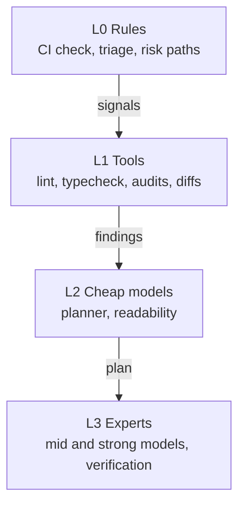

# Levels

A review should cost about as much as the change needs. To get there, eyeful starts each agent only
when a cheaper check has found something for it. Rules run first, then tools, then cheap models,
and the experts last. Each layer looks only at what the layer before it flagged. The level of a
review sets the highest layer it may reach and how closely the experts look. `workflow` implements
level choice, the routing rules and the budget; the L1 tools themselves are not built yet.

## The four layers

| Layer | Runs                                                                                                  | Model cost |
| ----- | ----------------------------------------------------------------------------------------------------- | ---------- |
| L0    | The CI check, triage, matching `risk` paths and file types                                            | none       |
| L1    | `lint`, `typecheck`, `secret_scan`, `dependency_audit`, `openapi_diff`, `complexity`, `coverage_diff` | none       |
| L2    | The planner, the readability expert, turning tool output into comments                                | small      |
| L3    | The correctness, security, design, tests and usability experts, and reproduction                      | most       |

L0 and L1 are deterministic and use no tokens, so every review runs them. Their output is also what
the upper layers act on.

## Levels

| Level    | Always runs     | Experts                                                                | What they report                                                | Verification                                                          |
| -------- | --------------- | ---------------------------------------------------------------------- | --------------------------------------------------------------- | --------------------------------------------------------------------- |
| quick    | L0, L1          | Up to 2 experts on cheap models, only where an L1 tool found something | Problems that change behaviour or break a contract              | none                                                                  |
| standard | L0, L1, planner | Chosen by the planner                                                  | Problems that change behaviour or break a contract              | Reproductions in verification order, plus the touched packages' tests |
| deep     | L0, L1, planner | Chosen by the planner, on strong models                                | The same, plus naming, style, wording and small simplifications | Every reproduction, plus the full suite and E2E                       |

The quick level has no planner. Rules send tool output to experts: a `secret_scan` hit to security,
a `typecheck` error to correctness, an `openapi_diff` break to usability. If no tool finds anything,
a quick review is just the list of tool results and uses no tokens. For this reason quick is the one
level that does not require every line to be reviewed ([Planning and triage](PLANNER.md#triage)).

The level is how closely a review looks, and eyeful sets it from the change alone. At both standard
and deep the planner reads the change, groups it and picks the experts it needs
([The plan](PLANNER.md#the-plan)); there is no limit on how many. What changes is the bar for a
finding. At standard the experts report only problems that change behaviour or break a contract, and
Go leaves out any `low` finding that arrives anyway, which the feedback counts. At deep the experts
also report naming, style, wording and small simplifications as `low`, run on strong models, and the
verifier runs the full suite. The heavier tools inside an expert run only on request at both levels:
`sast`, `e2e_run` and `a11y_check` run when the expert calls them.

A few signals start an expert at every level:

| Signal                                         | Effect                  |
| ---------------------------------------------- | ----------------------- |
| A known CVE in an added or upgraded dependency | security runs           |
| A secret in the diff                           | security runs           |
| A breaking change in the API document          | usability runs          |
| A change to a `risk` path                      | the level rises to deep |

## Choosing the level {#choosing-the-level}

Nobody picks the level; eyeful chooses it from the change, the way revmux runs one default profile
instead of asking. A change that touches a `risk` path from
`.eyeful/config.yml` or a `CODEOWNERS` path, or a diff of more than 2,000 changed lines, gets deep, and everything else
gets standard. If the planner reports low confidence, the level goes up; it does not go down. A
review can move up a level while running and reuse what has already run.

Each level has a budget in tokens and money, and each command the verifier runs has its own timeout.
There is no limit on total minutes, since a project's own tests may take longer than any fixed
limit. Go checks the budget before it starts each agent, so agents already running when it runs out
still finish; at most four experts run at once, which bounds how far they can go over
([Running locally](LOCAL.md#agents)). From then on the review starts no more agents and returns what it has verified, with
result `partial`. Quick is never chosen for a change; the [evaluation](EVALUATION.md) fixes the
level through the workflow's request to measure what standard adds over quick.

## Why start agents on demand

Running every expert on every change is simple but expensive. Most changes need two or three
experts, and a linter or an audit already catches many problems. Starting experts only on a signal
keeps the cost in line with the change. Whether this loses findings is measured in the
[evaluation](EVALUATION.md#ablations), which compares it with running every expert.
