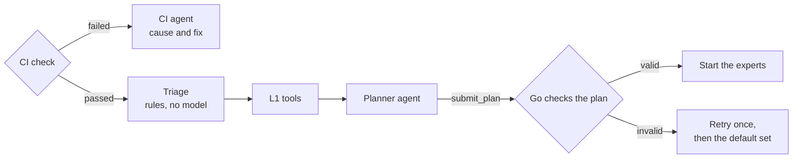

# Planning and triage

The first stage of a review checks whether the change is ready to review, sets aside files that need
no review, and decides which experts review the rest. It runs in three steps, cheapest first.
`workflow` implements the steps and every rule on this page. The L1 tools, the CI reading on GitHub
and the planner's prompt and `submit_plan` tool belong to the runtimes, which are not built yet.



## CI check {#ci-check}

If a change does not build or its own tests fail, most findings would repeat what CI already
reports. The stage therefore starts by checking CI.

In the cloud, eyeful reads the GitHub Actions workflow runs for the head commit. While any run is in
progress, the review waits. If all runs passed, or the repository has no workflows, the review
continues.

Locally there is no CI run to read. The verifier runs the `lint` command from
[`.eyeful/config.yml`](CONFIGURATION.md#project) and the L1 `typecheck` in the work directory. The
full `test` command runs only at deep, since a project's whole suite can take longer than the
review.

If the check fails, no expert starts. The CI agent, the only agent this step can start, reads the
logs of the failed jobs (or the local command output) and reports, for each failure, the workflow,
job and step, the cause, and how to fix it. The review ends with result `ci_failed`. When CI passes
the check costs nothing; when it fails it costs one agent run.

## Triage {#triage}

Triage sorts the changed files with rules and no model. Glob patterns pick out lockfiles, generated
code, vendored code, binary files and the `skip` paths from `.eyeful/config.yml`, and a size rule
sets aside any file whose diff is larger than 512 KB. These files go to
no expert and are listed in the feedback as not reviewed. Following Google's
[Every Line](https://google.github.io/eng-practices/review/reviewer/looking-for.html#every-line),
every other line must go to at least one expert. The quick level is the exception: there, only
lines that a tool flagged are reviewed ([Levels](LEVELS.md)).

The remaining files become a manifest with one line per file:

```text
path                      class   +lines  -lines
app/auth/session.py       code        12       3
app/auth/test_session.py  test         0       0
web/src/Login.svelte      code        40      18
package-lock.json         lock       310     120
commits: "fix session expiry at the boundary", "show the expiry on the login page"
```

Triage also runs the L1 tools for the project's languages (`lint`, `typecheck`, `secret_scan`,
`dependency_audit`, `openapi_diff`, `complexity`, `coverage_diff`) and attaches their output to the
manifest. These tools use no tokens, and their output is what the planner works from
([Levels](LEVELS.md)).

## Large changes {#large}

A change of more than 2,000 changed lines in the files triage kept is split into scopes before
anything is planned, following pulls.review's practice of reviewing a large change one scope at a
time. Go does the split from the paths alone, with no model, so the same change always gives the
same scopes, in the cloud and locally:

1. Files are sorted by path and grouped by their first directory, then by their first two. A group
   still over 2,000 lines after two levels is cut, in path order, into parts of at most 2,000 lines;
   a single larger file is a part on its own.
2. Neighbouring groups are packed together while the total stays within 2,000 lines, so a scope is
   never mostly empty.
3. Each scope, in order, gets its own plan and its own experts, with the scope's files as the
   manifest. The planner never sees a manifest larger than one scope, and Go checks each plan
   against its own scope.
4. Each scope may spend an equal share of the review's budget. A scope that uses up its share
   starts no more agents, the review ends `partial`, and the scopes after it still run.

The level is chosen once for the whole change ([Choosing the level](LEVELS.md#choosing-the-level)),
and verification and the summary run once over the findings of every scope. The report lists the
scopes in order, which the author can use to split the change into a stack
([The ranked report](REPORT.md#ranked-report)); eyeful never creates branches or pull requests.

## The plan {#the-plan}

The quick level has no planner; rules send each tool result to an expert. At standard and deep, the
plan has two steps: [`@pulls.review/core`](https://github.com/antfu/pulls.review) works out what
the change does and groups it, and Go picks the experts for each group by rule.

### Grouping the change

eyeful uses pulls.review's own analysis, not a copy of it. `packages/pulls` bundles the functions of
`@pulls.review/core` that a local agent needs into `workflow/pulls/core.js`, and Go runs that file
with [moejs](https://github.com/Calcium-Ion/moejs), a JavaScript runtime in pure Go, so the
binaries need neither Node nor cgo. The planner is one call to the connected agent:

1. core parses the diff of the files triage kept (`parsePatch`) and builds the prompt pulls.review
   gives a local agent (`buildCliAgentSystemPrompt` and `buildAnalysisPrompt`): the file manifest
   with each file's hunk headers, the diffs when they fit, and the path of the run's `change.diff`,
   which the agent reads where the manifest is not enough;
2. the agent answers with core's `Analysis` (`analysisJsonSchema`): a summary of why the change was
   made, and groups by intent, each with the part of the system it touches (`category`), a label,
   a summary, its files, and `critical` where it needs extra care;
3. core checks the answer against its schema and that every file is in exactly one group
   (`findCoverageIssues`). A rejected answer goes back to the agent once with core's reason; after a
   second rejection, or two failed calls, the review uses the default experts for its level, one
   group with every kept file, and the feedback says so.

```json
{
	"overallSummary": "Sessions are now treated as expired at the exact expiry second, and the login page shows when a session ends.",
	"groups": [
		{
			"key": "session-expiry",
			"label": "Session expiry",
			"summary": "A session was still accepted at the second it expired.",
			"category": "security",
			"critical": true,
			"filePaths": ["app/auth/session.py"]
		},
		{
			"key": "login-page",
			"label": "Login page",
			"category": "ui",
			"filePaths": ["web/src/Login.svelte"]
		}
	]
}
```

A group is core when core marks it `critical` or when it holds a `risk` path from
`.eyeful/config.yml`. Core groups come first and their experts look at them first.

### Picking the experts

Go turns each group into experts with a fixed table, so the same grouping always gets the same
experts:

| Category                             | Experts               |
| ------------------------------------ | --------------------- |
| `security`                           | correctness, security |
| `core`, `api`, `data`, `cli`         | correctness           |
| `ui`, `i18n`                         | usability             |
| `tests`                              | tests                 |
| `docs`, `examples`                   | readability           |
| `config`, `build`, `scripts`, `deps` | security              |
| `assets`, `other`                    | none                  |
| a core group, in addition            | correctness, security |
| a core group at deep, in addition    | design                |

Each expert then runs once over all of its groups ([Experts](EXPERTS.md)). Go also adds the experts
that signals call for ([Levels](LEVELS.md)) and sets their budgets.
