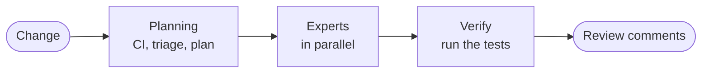

# Overview

eyeful reviews code changes with a group of agents. A planner picks the experts a change needs, the
experts review in parallel against public standards, and eyeful runs the test each one writes to
prove a bug. The result reaches a person as review comments.

## Status

Local reviews work: `eyeful review`, `provider`, `connect`, `commit` and the desktop app run the
whole workflow with your own coding agent ([Running locally](LOCAL.md)). Cloud reviews (agents in pi,
the sandbox), the L1 tools and the experts' own tools are planned; the pages that describe them say
so, and the [roadmap](ROADMAP.md) puts them in order.

## Documents

How a review works:

| Document                                     | Covers                                                             |
| -------------------------------------------- | ------------------------------------------------------------------ |
| [A review, end to end](REVIEW.md)            | Confirmation, stages, results, the review standard, rules          |
| [Planning and triage](PLANNER.md)            | The CI check, triage, large changes, the plan and how Go checks it |
| [Levels](LEVELS.md)                          | The four layers and what each level runs                           |
| [Experts](EXPERTS.md)                        | Each expert's checklists, tools and evidence                       |
| [Evidence and verification](VERIFICATION.md) | Oracles, evidence kinds, the verifier                              |
| [Review feedback](REPORT.md)                 | Comment format, line comments, the ranked report, rounds           |
| [Running locally](LOCAL.md)                  | Desktop and CLI, the snapshot, the agents' CLIs, local risks       |
| [Running in the cloud](CLOUD.md)             | Pull requests, agents in pi, the sandbox                           |
| [Questions and answers](FAQ.md)              | What is reviewed, large changes, files that change during a review |
| [References](REFERENCES.md)                  | Review, security and accessibility standards; borrowed projects    |
| [Principles](PRINCIPLES.md)                  | The author's eight working principles, a summary only              |

The thesis: [Evaluation](EVALUATION.md), with the research question and the experiment.

How the code is built:

| Document                                  | Covers                                                    |
| ----------------------------------------- | --------------------------------------------------------- |
| [Architecture](ARCHITECTURE.md)           | Components, layout, dependency direction, lifecycle       |
| [Scheduling and leases](SCHEDULING.md)    | Admission, leases, retries, provider routing, rate limits |
| [Sign-in and credentials](AUTH.md)        | Credentials and how they are protected                    |
| [Database and migrations](PERSISTENCE.md) | PostgreSQL schema, migrations, queries                    |
| [API](API.md)                             | HTTP conventions, errors, routes, MCP                     |
| [Local development](DEVELOPMENT.md)       | Setup, commands, code generation                          |
| [Code style and review](STYLEGUIDE.md)    | Coding rules and how changes are reviewed                 |

How it is deployed: [Deployment](DEPLOYMENT.md) and the [configuration reference](CONFIGURATION.md).
What comes next: the [roadmap](ROADMAP.md).

## About these documents

Each document owns one topic and describes what the code does now; planned work is marked. English
is the source and `zh/` is the Chinese translation, kept in step by `mise run lint`. The site is built
with VitePress (`mise run dev:docs`) and published to GitHub Pages from `main`.
