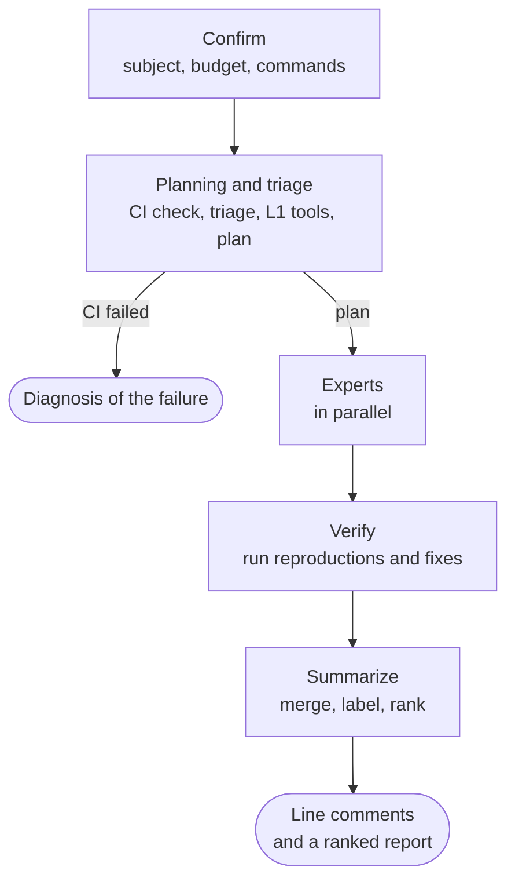

# A review, end to end

This page follows one review from the user's confirmation to the comments a person reads. The
stages are implemented in the `workflow` module ([Architecture](ARCHITECTURE.md#workflow)), but no
review runs them yet: the API accepts a review and a worker claims it, then a placeholder executor
ends it with result `none`, because the agents and the sandbox `workflow` needs are not built.

## Before it starts {#before-it-starts}

Before creating a review, the client shows what will be reviewed (a branch against its base, or
local changes), the budget, and the project commands that will run; eyeful chooses the level itself
([Levels](LEVELS.md#choosing-the-level)). The review is
created when the user confirms. Once it starts it cannot be cancelled; a review that is still queued
can be deleted.

The commands come from `.eyeful/config.yml`. Locally, the user confirms them again whenever they
change. If the repository has no such file, nothing runs and every finding stays unverified; an
agent proposing commands for the user to confirm is planned.

## Stages {#stages}

| Stage     | What it does                                                        | If it fails                                | Page                                         |
| --------- | ------------------------------------------------------------------- | ------------------------------------------ | -------------------------------------------- |
| planning  | CI check, checkout and setup, triage and L1 tools, the plan         | See below                                  | [Planning and triage](PLANNER.md)            |
| experts   | Each selected expert reviews its files with its standards and tools | The expert is dropped and listed as absent | [Experts](EXPERTS.md)                        |
| verify    | The verifier runs reproduction tests and suggested fixes            | The finding stays unverified               | [Evidence and verification](VERIFICATION.md) |
| summarize | Merges findings, writes them as Conventional Comments, ranks them   | Findings are formatted by rules instead    | [Review feedback](REPORT.md)                 |

When a stage fails, only that stage's work is lost, and the feedback says what failed. Two failures
end a review early. If the CI check fails, the review ends with result `ci_failed` and a diagnosis.
If the clone fails, it ends with `none`. A failed setup does not end the review: the experts still
review, and every finding is marked unverified
([Evidence and verification](VERIFICATION.md#the-verifier)).

Each stage writes its output (the plan, each expert's findings, each verifier run) to the run
archive when it finishes. If a worker dies, the next worker resumes from the last finished stage,
and model calls that already completed are not repeated.

The level of a review sets how many experts it may use, on which models, and how much it verifies
([Levels](LEVELS.md)).

## The review standard {#review-standard}

eyeful follows Google's
[Standard of Code Review](https://google.github.io/eng-practices/review/reviewer/standard.html). It
never approves a change, so it uses the parts of that standard about writing comments.

A comment is blocking only when it shows that the change introduces a bug, a vulnerability or a
regression. Ideas for making the change better are non-blocking suggestions. A finding backed by a
test that ran is ranked above one backed only by an argument. On style, the project's own style
guide decides, and a style point it does not mention can only be a `nitpick`. A design comment has
to name the engineering principle it is based on. An expert that sees a clear improvement can say
so with `praise`.

[Review feedback](REPORT.md) maps these rules to comment labels, and [References](REFERENCES.md)
lists the sources.

## States and results

A review moves from `queued` to `running` to `done`. A finished review has one of these results:

| Result      | Meaning                                                                      |
| ----------- | ---------------------------------------------------------------------------- |
| `complete`  | Every stage ran                                                              |
| `none`      | Nothing could be reviewed; `reason` explains why, for example a failed clone |
| `ci_failed` | The CI check failed, and the feedback explains the failure                   |
| `partial`   | The budget ran out, and the feedback holds what was verified by then         |

How workers claim, renew and finish reviews, and what happens when one dies, is in
[Scheduling and leases](SCHEDULING.md#reviews-over-workers).

## Rules {#rules}

The review standard above, taken from the literature, decides what a comment says. The rules below
decide how the workflow runs, and several of them enforce hard measures from `.agents/POLARIS.md`.

1. The agent decides what to do. Go decides whether it may, and owns every loop, budget and stop
   condition.
2. eyeful does not approve changes or block merges. A person merges.
3. Every run is recorded: who ran, what ran and what it cost. These records are also the thesis
   data.
4. A re-review receives the findings of the previous round, without its reasoning.
5. The user confirms before a review starts, and a started review runs to the end.
6. If CI fails, the change gets a diagnosis of the failure instead of a review.

## Open decisions {#open-decisions}

- Verdicts: should each expert give an overall verdict on its part, or should the summarizer decide
  what is blocking from evidence strength alone?
- Coverage: should "coverage does not decrease" be a hard rule, or an ordinary finding of the tests
  expert?
