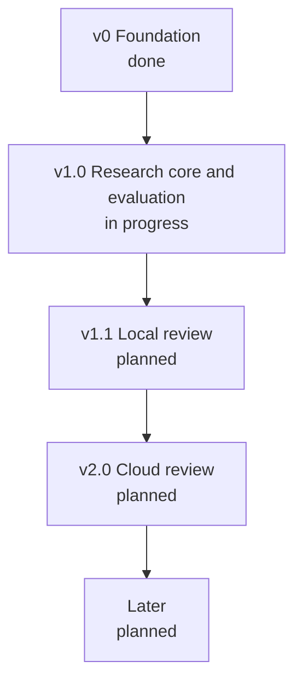

# Roadmap

This page lists what each version delivers and what it has to show before release. The other
documents describe the design and mark what is planned; this one puts that work in order. A version
is released when its exit criteria hold and no hard measure in `.agents/POLARIS.md` has regressed.

The thesis depends on one question: whether execution-based verification removes false positives
([Evaluation](EVALUATION.md#research-question)). The next version therefore builds only what that
question needs and runs the experiment. The local and cloud clients come after the data exists.

## v0: Foundation (done)

v0 is the base the later versions build on, and all of it is in the repository: GitHub App and
Gitee sign-in, API keys and sealed provider tokens ([Auth](AUTH.md)); the CRUD API, its OpenAPI
document and the TypeScript SDK ([API](API.md)); the PostgreSQL queue with leases, fencing and a
reaper, plus provider routing that is built but not wired in ([Scheduling](SCHEDULING.md)); the
console's repository browser; the desktop window that lists local changes; and CI running
`mise run check`. Little of this answers the research question, which is why v1.0 narrows the
scope.

## v1.0: Research core and evaluation (in progress)

v1.0 contains only what the experiment needs, driven from the command line against a dataset:

- The `workflow` module: planning and triage, experts, verifier and summarizer
  ([stages](REVIEW.md#stages)). The CI check is reduced to running the dataset's own tests.
- The two experts whose findings can be reproduced, correctness and security, with their skills,
  tools and checklists ([Experts](EXPERTS.md)).
- The verifier with the oracle rule ([Evidence and verification](VERIFICATION.md)), and the
  read-only judge used as the comparison condition.
- Agents in pi only, with model keys that eyeful controls, so every token is counted
  ([Agents in pi](CLOUD.md#agents-in-pi)).
- Subjects running in SWE-bench's Docker environments, and in containers for the injected-bug set.
- The run archive, which holds every number the thesis reports, and stage checkpoints.
- The quick and standard levels, with feedback as SARIF and Markdown.
- `eval/`: the datasets, the three conditions, the labelling workflow and the ablations
  ([Evaluation](EVALUATION.md)).

Exit criteria:

- The main experiment has run on both bug sets in all three conditions, and the findings are
  labelled as the evaluation describes.
- Every `issue (blocking)` in those runs was seen failing by the verifier and has an `implicit`,
  `existing` or `spec` oracle.
- A review that runs out of budget returns what it verified, marked partial. A worker killed in the
  middle of a review resumes from its last finished stage.
- The thesis can report what standard adds over quick, which is how v1.0 measures proportion.

Until v1.0 is released, the console, the desktop app, Gitee sign-in, CORS, rate limits and MCP get
no new features. They keep working and keep their tests.

## v1.1: Local review (planned)

v1.1 runs the same workflow on the user's machine ([Running locally](LOCAL.md)). It adds
`local/agents`, which runs the user's own coding agent CLIs without MCP; the snapshot and its disposable checkout
for project commands; `eyeful review` and the desktop app starting a review after confirmation;
and the experts v1.0 left out (design, tests, usability, readability). Migrations change from
editing `0001_init` to one file per change ([Persistence](PERSISTENCE.md)).

Built ahead of v1.0, because the experiment's experts and verifier can be tried on real changes
with it: `local/agents` without MCP, the snapshot and its checkout, all six experts with skills
from skills.sh, `eyeful review`, `provider` and `connect`, and the desktop app doing the same.

Exit criterion: `eyeful review` on eyeful's own repository returns feedback without calling the
server, and no credential or model key leaves the machine.

## v2.0: Cloud review (planned)

v2.0 runs the workflow on pull requests ([Running in the cloud](CLOUD.md)). It adds the CI check
against GitHub Actions; `internal/checkout` and `internal/sandbox`, with one credential-free sandbox
per review; sources, the outbox and sinks; comments posted as a `COMMENT` review with the optional
Check Run; the deep level with the full suite and E2E; SSE progress; and a `runner` command.

Exit criterion: a cloud review of an untrusted pull request finishes with code running only inside
its sandbox, and a worker killed mid-review loses nothing and runs nothing twice.

## Later (planned)

MCP on `POST /mcp` ([API](API.md#mcp-planned)), webhook and scheduled sources, a performance expert,
and team ownership of reviews.
