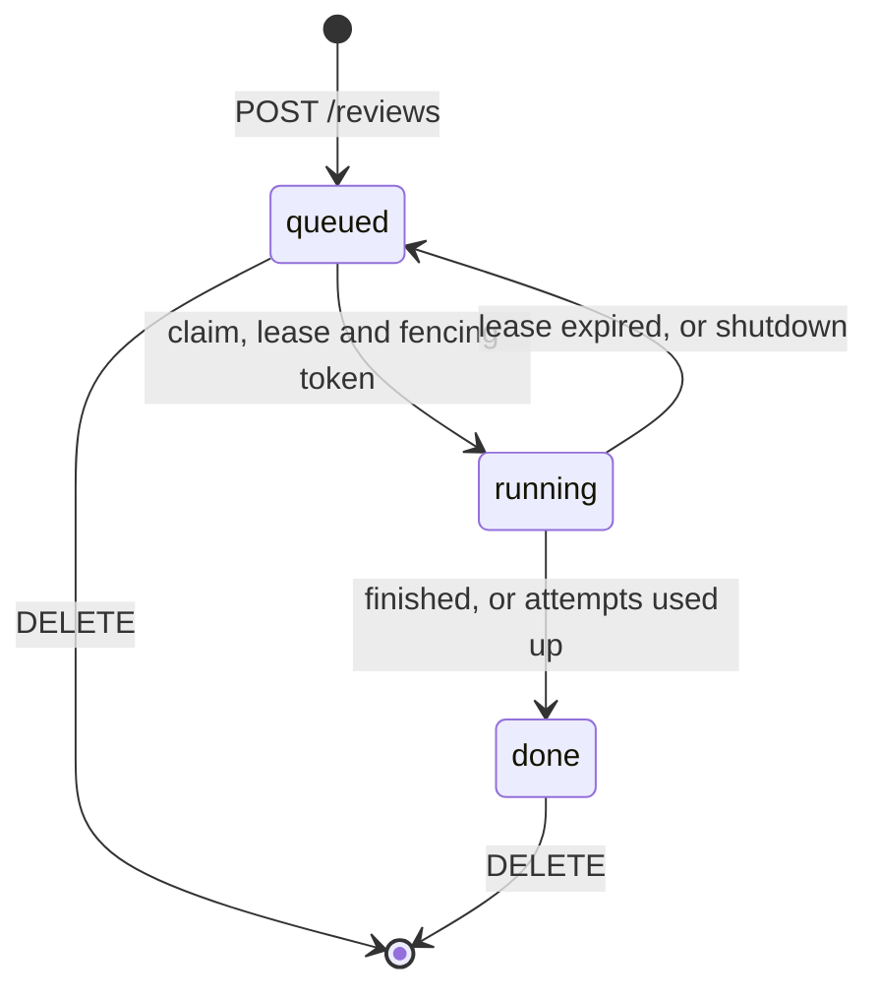

# Scheduling and leases

Scheduling happens at two levels. Reviews are assigned to workers by `internal/scheduler`, which is
running today. Agent runs are assigned to model providers by `internal/dispatch`, which is built and
tested and will be wired in once the pi runtime exists. At both levels a failure affects only the
unit that failed, and every decision records its reason.

## Reviews over workers {#reviews-over-workers}



| Mechanism | Behavior                                                                                                  |
| --------- | --------------------------------------------------------------------------------------------------------- |
| Admission | A request repeated with the same `Idempotency-Key` returns the first review; a different body gets `409`. |
| Claim     | `SELECT … FOR UPDATE SKIP LOCKED` on the oldest queued review; the token comes from a sequence.           |
| Renewal   | Every third of `--lease-ttl`; a transient error is retried on the next tick.                              |
| Fencing   | `Renew`, `Finish` and `Release` with an outdated token fail with `ErrFenced`.                             |
| Finish    | An executor error becomes result `none` with the error as reason; no error gives `complete`.              |
| Reaper    | Expired leases go back to the queue; after `--max-attempts` the review is `done` with result `none`.      |
| Delete    | Only queued or done reviews, in one statement, so a delete and a claim cannot both succeed.               |
| Shutdown  | Running reviews are released back to the queue without counting an attempt.                               |
| Capacity  | `--workers` per process; more capacity means more processes on the same database.                         |

The server uses `review.PostgresStore`. `reviewtest.MemoryStore` implements the same contract for tests
([Persistence](PERSISTENCE.md#tests)).

## Agent runs over providers {#agent-runs-over-providers}

An agent asks for a tier (`cheap`, `mid` or `strong`). A tier is a list of candidates, one per key:

```yaml
strong:
  - { model: anthropic/claude-sonnet-5-5, priority: 0, weight: 3 }
  - { model: openrouter/anthropic/claude-sonnet-5-5, priority: 0, weight: 1 }
  - { model: deepseek/deepseek-v4, priority: 1 }
```

| Mechanism    | Behavior                                                                                                     |
| ------------ | ------------------------------------------------------------------------------------------------------------ |
| Selection    | The lowest available priority, then weighted random within it; each retry moves down one priority.           |
| Decision     | `Decide` returns retry or stop, with a reason such as `output_committed` or `non_retryable`.                 |
| Cooldown     | Out of credit: 30 min. Quota: until it resets. Rate limit: `Retry-After`. Otherwise 1 min, doubling.         |
| Commit point | Once an agent has reported anything, a later failure fails the agent instead of switching models.            |
| Lanes        | `max_concurrency` per key; extra requests wait in FIFO order. Waiting never causes a fallback or a cooldown. |

Planned: per-review affinity (one candidate per role) and classification of provider errors. Level
budgets are kept by `workflow` ([Levels](LEVELS.md#choosing-the-level)).

## Rate limits {#rate-limits}

A fixed window per client IP answers `429 rate_limited` with `Retry-After`. `--rate-limit` applies to
every API route (default 600 per minute) and `--critical-rate-limit` to sign-up, sign-in and new
reviews (default 30 per minute). The window is kept in memory. A Redis window shared by several
servers is planned.

## Not done yet

- A `runner` command that only claims and executes reviews.
- A worker that stops itself once renewals have failed for longer than the TTL. Until then, a worker
  that has lost its connection can keep running alongside its replacement. Fencing discards its
  result, but its model spend is not recovered.
- The run archive. `workflow` already saves each stage's output through its `Archive` interface and
  skips the stages it finds there ([Architecture](ARCHITECTURE.md#workflow)), but nothing stores
  them yet, so a reclaimed review cannot resume from its last finished stage.
- Retrying a failed `Finish`, SSE progress, and moving a running review up a level.
