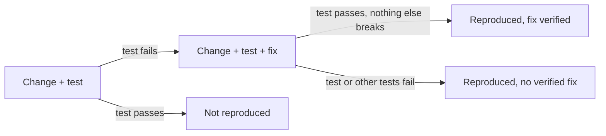

# Evidence and verification

This page describes how eyeful decides how far to trust a finding. Experts read code, call their
tools and propose tests. The verifier, which is plain Go code in `workflow`, runs those tests and
records the outcome. It runs them through the review's workspace, which is not built yet.

## The oracle problem {#oracle}

When a test fails, all it shows is that the code and the test disagree. It does not show that the
test is right. An expert that misreads what the code should do will write a test that fails by its
own reading, then a fix that makes the test pass, and both steps succeed. Whether a session should
expire at `expires_at` or one second later is a question for the specification. The code cannot
settle it.

A reproduction therefore counts as strong evidence only when the expected behaviour comes from
somewhere other than the agent. Each reproduction test declares its oracle, the source of the
behaviour it expects, and the verifier records it:

| Oracle     | Where the expected behaviour comes from                                                                     | Strength |
| ---------- | ----------------------------------------------------------------------------------------------------------- | -------- |
| `implicit` | No specification needed: a crash, an unhandled error, a data race (`-race`), a sanitizer report, a timeout  | strong   |
| `existing` | A test already in the repository that now fails                                                             | strong   |
| `spec`     | Text the finding quotes: the issue, the pull request description, documentation, a docstring, an API schema | strong   |
| `base`     | The base commit behaves differently, though the change may have intended that                               | medium   |
| `agent`    | Only the expert's own reading of the code                                                                   | weak     |

A finding with a `base` or `agent` oracle cannot be blocking. Its reproduction is turned into a
`question` for the author, with the failing test attached. The suggested fix is written by a
separate agent, which sees the finding and the test but not the expert's reasoning, so that the fix
is not just the expert's assumption written a second time.

## Evidence kinds {#evidence-kinds}

| Kind           | Produced by              | What ran                                                               | Strength                   |
| -------------- | ------------------------ | ---------------------------------------------------------------------- | -------------------------- |
| `repro_test`   | correctness, security    | A test that fails on the change                                        | the strength of its oracle |
| `cve`          | security                 | `dependency_audit` or `cve_lookup` matched a known advisory            | strong                     |
| `api_break`    | usability                | `openapi_diff` found a breaking change                                 | strong                     |
| `coverage`     | tests                    | The coverage command, compared line by line with the diff              | strong                     |
| `tool`         | any                      | Another tool: `sast`, `secret_scan`, `typecheck`, `lint`, `a11y_check` | medium                     |
| `e2e`          | usability                | The project's E2E command, with screenshots                            | medium                     |
| `trigger_path` | security                 | Nothing; the expert describes how the problem is reached               | medium                     |
| `argument`     | design, readability, any | Nothing; the expert explains, citing code or a standard                | weak                       |

Sometimes a reproduction is proposed but not run, because the level does not allow it, the budget
ran out, or the project could not be set up. The finding then keeps the weaker kind and is marked
unverified.

## Tests prove findings

eyeful does not write tests to raise coverage. A test is how an expert shows that a functional error
exists: if the expert is right, a small test fails on the change. The test belongs to the finding,
and it is offered to the author only together with the fix it proves.

## The verifier {#the-verifier}

The verifier is the only part of eyeful that runs the project's code. It runs only the commands in
[`.eyeful/config.yml`](CONFIGURATION.md#project) and eyeful's own tools.

Strength is known only after verification, so the verifier needs an order that does not depend on
it. It takes findings whose test has an `implicit`, `existing` or `spec` oracle first, then sorts by
the severity the expert declared, then by how many experts reported the same lines. The level
decides how many findings get verified ([Levels](LEVELS.md)).

For a finding with a reproduction test, the verifier:

1. copies the checkout of the change, adds the test and runs it, and the test has to fail;
2. applies the suggested fix to a fresh copy that also has the test, runs it again, and the test has
   to pass;
3. runs the tests of the packages the change touches on that copy. At deep it runs the full suite
   instead, in the order build, unit, integration, E2E, and stops at the first failure. Nothing that
   passed before may fail.



A reproduced finding then has the strength of its oracle. A finding whose test passes on the change
gets no comment; the uncertainty checklist lists it as dismissed.

All of this depends on the project installing and its tests running, which is the main practical
limit of the approach. Many repositories need services such as a database, or more than one setup
command. When `setup` fails, the review continues as a read-only review. Every finding is marked
unverified, and the feedback explains why.

## An example

A correctness expert reviewing `app/auth/session.py` proposes this test:

```python
from app.auth.session import Session, is_expired

def test_expired_at_exact_boundary():
    assert is_expired(Session(expires_at=100), now=100)
```

The fix agent proposes:

```python
def is_expired(session, now):
    return now > session.expires_at  # [!code --]
    return now >= session.expires_at  # [!code ++]
```

The test fails on the change and passes with the fix. How strong the finding is depends on the
oracle. If the pull request says "a session expires at `expires_at`", the oracle is `spec`, and the
finding becomes an `issue (blocking)` with the fix attached. If nothing says where the boundary
should be, the oracle is `agent`, and the same test becomes a `question`: "Should a session still be
valid at exactly `expires_at`? This test fails on the change." The verifier writes the result; the
expert cannot mark its own test as passed.

## Findings as SARIF {#sarif}

Every finding, whatever produced it, is stored as a result in
[SARIF 2.1.0](https://docs.oasis-open.org/sarif/sarif/v2.1.0/sarif-v2.1.0.html), the OASIS standard
format for static analysis results. Output from tools that already write SARIF, such as Semgrep and
gitleaks, is read as it is. An expert's `submit_report` findings are converted into the same shape.
Standard fields hold what the standard defines them for, and eyeful's own fields go in the property
bag:

| SARIF field      | Holds                                                                        |
| ---------------- | ---------------------------------------------------------------------------- |
| `ruleId`, `taxa` | The rule or tool check, and the CWE identifier where there is one            |
| `level`          | `error` for a blocking `issue`, `warning` for other issues, `note` otherwise |
| `kind`           | `fail` once the verifier reproduced it, `review` while it needs a person     |
| `message`        | The subject and the discussion of the comment                                |
| `locations`      | File and line                                                                |
| `codeFlows`      | A security trigger path, step by step                                        |
| `fixes`          | The suggested fix, as artifact changes                                       |
| `properties`     | `expert`, `evidence`, `oracle`, `label`, `decorations`, `corroboratedBy`     |

The finding from the example, with the pull request description as its oracle:

```json
{
	"ruleId": "eyeful/correctness/boundary",
	"level": "error",
	"kind": "fail",
	"message": { "text": "A session is still valid at exactly expires_at." },
	"locations": [
		{
			"physicalLocation": {
				"artifactLocation": { "uri": "app/auth/session.py" },
				"region": { "startLine": 11 }
			}
		}
	],
	"fixes": [
		{
			"description": { "text": "Treat the expiry second as expired" },
			"artifactChanges": [
				{
					"artifactLocation": { "uri": "app/auth/session.py" },
					"replacements": [
						{
							"deletedRegion": { "startLine": 11, "endLine": 11 },
							"insertedContent": { "text": "    return now >= session.expires_at\n" }
						}
					]
				}
			]
		}
	],
	"properties": {
		"expert": "correctness",
		"evidence": "repro_test",
		"oracle": "spec",
		"label": "issue",
		"decorations": ["blocking", "correctness"],
		"corroboratedBy": ["security"]
	}
}
```

The same SARIF file is used to write the review comments, to upload to GitHub code scanning, and for
the [evaluation](EVALUATION.md).

## Relation to CI

For the test suites eyeful does not run, the project's own CI remains the authority. In the cloud,
the [CI check](PLANNER.md#ci-check) has already required them to pass before the review started.
