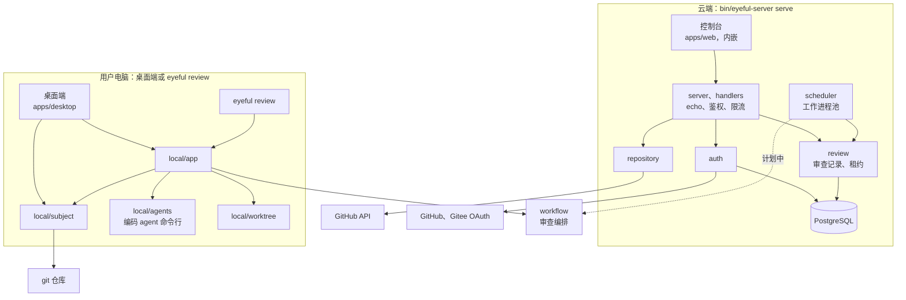
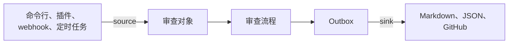
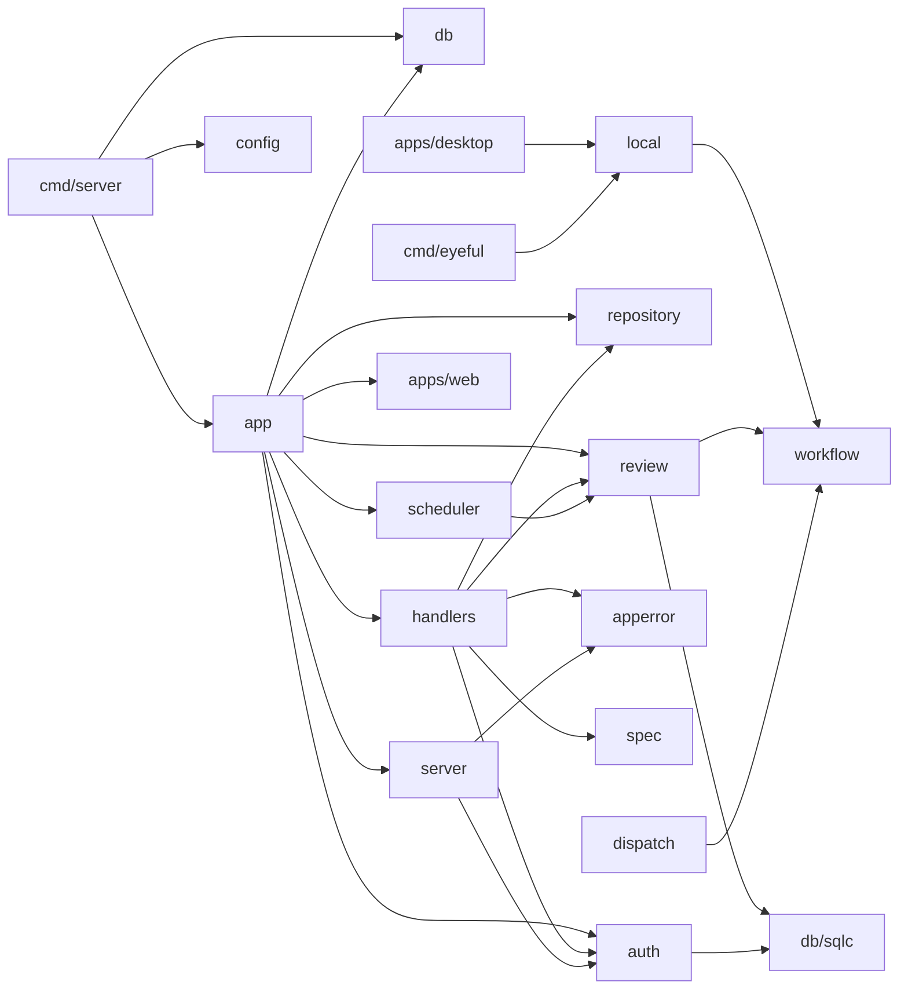
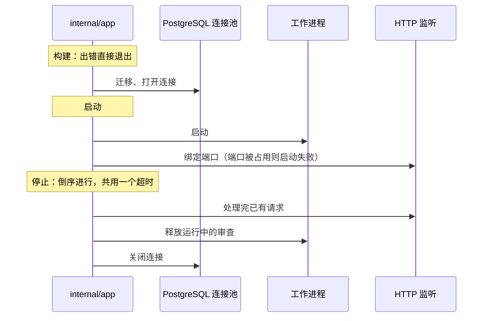

# 整体架构

本页介绍 eyeful 的代码怎样组织、依赖的方向，以及进程怎样启动和停止。eyeful 拿到改动后做什么，见[一次审查的全过程](REVIEW.md)及之后几页。

eyeful 分为云端和本地两部分，两者使用同一套审查流程。云端服务 `eyeful-server` 是一个 Go 二进制文件，内嵌控制台、数据库迁移和 API 文档，唯一的外部依赖是 PostgreSQL。本地部分是桌面端和 `eyeful` 命令，不需要服务端。每个二进制文件只包含自己这一侧的代码，两部分之间也不交换数据。

## 组件

虚线表示计划中的部分。

在云端，控制台是一个静态的 SvelteKit 应用，由同一个二进制文件提供。请求先经过 `server`（鉴权和限流），再到 `handlers`。`handlers` 负责处理 HTTP，并调用各领域包：`auth` 管账号和凭据，`review` 管审查记录和租约，`repository` 用当前登录用户的 token 读取 GitHub。`scheduler` 运行工作进程，从 PostgreSQL 领取排队中的审查。工作进程目前仍用占位执行器结束每个审查：`workflow` 已经写好，但云端要提供给它的 pi 运行时和沙箱还没有。

在用户电脑上，桌面端是命令行功能的一层窗口：它调用同样的 `local` 包：用 `local/subject` 显示改动，用 `local/app` 管理 agent 和发起审查，审查的日志和确认通过 Wails 事件传到窗口。桌面端和命令行都不会访问云端服务端或 PostgreSQL。`eyeful review` 经由 `local/app` 运行：用 `local/subject` 读取改动，用 `local/worktree` 在 `execution` 时检出快照，再运行 `workflow`，agent 由 `local/agents` 调用用户的编码 agent 命令行提供（见[本地运行](LOCAL.md)）。两部分共享的代码只有 `workflow`。

## 审查流程模块 {#workflow}

`workflow` 负责一次审查从 CI 检查到生成评论的全过程，阶段划分见[一次审查的全过程](REVIEW.md#stages)。它自己不启动 agent、不执行命令，也不做存储，而是由调用方在 `Session` 里传入三个接口，云端和本地各自实现：

| 接口        | 提供什么                                                                                                           | 云端               | 本地                             |
| ----------- | ------------------------------------------------------------------------------------------------------------------ | ------------------ | -------------------------------- |
| `Agents`    | 每个角色一次调用：诊断 CI、制定计划、专家审查、写修复、评判、汇总。每次调用返回对应类型的结果和花掉的 token 与费用 | pi 进程（计划中）  | 命令行运行，`local/agents`       |
| `Workspace` | CI 检查、`setup`、L1 工具，以及在一份新副本上应用指定修改后运行测试                                                | 审查沙箱（计划中） | 快照的检出，`local/worktree`     |
| `Archive`   | 按键读写每个阶段的输出                                                                                             | 运行档案（计划中） | `.eyeful/runs/`，`local/archive` |

所有循环都由 Go 控制。`workflow` 按规则检查每份计划、报告和汇总，管理预算，决定何时重试、何时停止，并在下一阶段开始前把当前阶段的输出存进档案，所以恢复执行的审查不会重复已经完成的 agent 调用。专家名单（名称、模型档位、skill、证据类型）在 `workflow.New` 时传入。`workflow/prompts` 存放交给 agent 的全部内容：专家和各角色的提示词、工具定义以及每个角色能用哪些工具、从 skills.sh 引入的 skill，以及每个任务怎样写成提示词，所以云端和本地的 agent 拿到的是同样的文字；`workflow/project` 为两边读取 `.eyeful/config.yml`；`workflow/report` 把审查结果写成 Markdown 和 SARIF。`workflow` 不用 fx，不碰数据库，也不引用服务端的类型；它依赖的是处理 glob、diff、YAML 和 SARIF 的常用库，以及运行打包好的 `@pulls.review/core`（负责给改动分组，见[审查计划](PLANNER.md#the-plan)）的 moejs。`workflow.SplitPatch` 把 `git diff` 的输出拆成改动里的各个文件，云端和本地都用它。

## 语言

服务端、命令行、审查流程、调度、沙箱、GitHub 访问和 REST API 用 Go 编写，服务端和本地命令行各是一个二进制文件。控制台、桌面端前端和 pi 扩展用 TypeScript 编写，HTTP 类型从 spec 生成。Python 只用于效果评测。agent 在云端运行于 pi，在本地是用户自己的编码 agent 命令行；eyeful 没有自己的 agent 循环。

## 目录结构 {#layout}

### 模块

共享代码和本地代码是仓库根目录下的独立 Go 模块，由编译器保证它们之间的边界（见[本地运行](LOCAL.md)、[云端运行](CLOUD.md)）：

| 模块       | 内容                                            | 可以导入             | 使用者                       |
| ---------- | ----------------------------------------------- | -------------------- | ---------------------------- |
| `workflow` | subagent 编排及其接口                           | 不导入仓库内其他模块 | `local`、`internal`          |
| `local`    | 命令行和桌面端共用的本地能力                    | `workflow`           | `cmd/eyeful`、`apps/desktop` |
| 根模块     | `cmd/`（两个二进制文件）、`internal/`（服务端） | `workflow`、`local`  | `eyeful`、`eyeful-server`    |

`local/go.mod` 不依赖根模块，所以本地代码即使写错也导入不了服务端代码。Go 构建二进制文件时只链接它的 `main` 包导入的代码：`cmd/eyeful` 只导入 `local` 和 `workflow`，不导入 `internal/` 下的任何包；`cmd/server` 不导入 `local`，所以两个二进制文件都不包含另一侧的代码。桌面端是第四个模块，见下文“前端”。

### 目录

| 路径                    | 内容                                                                                                                                                                    |
| ----------------------- | ----------------------------------------------------------------------------------------------------------------------------------------------------------------------- |
| `cmd/eyeful`            | 本地命令行（kong）：`review`、`provider`、`connect`、`commit`                                                                                                           |
| `cmd/server`            | 服务端二进制入口（kong）：`serve`、`migrate`                                                                                                                            |
| `apps/web`              | 云端控制台：SvelteKit，构建到 `dist/`，由 `embed.go` 内嵌                                                                                                               |
| `apps/desktop`          | 本地图形界面，功能对应 `eyeful review`：Wails v3，独立的 Go 模块；`build/` 放打包资源                                                                                   |
| `apps/desktop/frontend` | 桌面端的 SvelteKit 前端，构建到 `dist/` 后内嵌；Wails 绑定在 `bindings/`                                                                                                |
| `packages/ui`           | shadcn-svelte 组件、diff 视图、文件树、主题和深色模式；文案通过 props 传入                                                                                              |
| `packages/pulls`        | 用 Vite+ 从 `@pulls.review/core` 构建 `workflow/pulls/core.js`（`generate:pulls`）                                                                                      |
| `workflow`              | 审查编排，独立的 Go 模块：分诊、计划检查、专家、验证、汇总、预算、检查点                                                                                                |
| `workflow/prompts`      | 内嵌的专家和角色提示词、每个角色的工具定义、来自 skills.sh 的 skill，以及把每个角色的任务写成提示词的代码                                                               |
| `workflow/pulls`        | 打包成 `core.js` 的 `@pulls.review/core`，用 moejs 运行：解析 diff、生成分组提示词和 schema、校验答案                                                                   |
| `workflow/project`      | `.eyeful/config.yml`：项目命令、`skip`、`risk`，以及确认记录所用的摘要                                                                                                  |
| `workflow/report`       | 把审查结果写成 Markdown 和 SARIF 2.1.0                                                                                                                                  |
| `local`                 | 本地模式，独立的 Go 模块：`subject` 给本地分支、提交或未提交的改动取快照                                                                                                |
| `local/app`             | 本地的组装入口，命令行和桌面端执行操作时只调用它：审查、provider、连接、提交                                                                                            |
| `local/agents`          | 通过编码 agent 自己的命令行（claude、codex、pi）实现 `workflow.Agents`，每次调用一个进程，只带只读工具：把 `workflow/prompts` 写好的提示词从 stdin 传入，读回结果和用量 |
| `local/worktree`        | 快照的一次性检出和 `workflow.Workspace`：确认过的命令、修改、恢复原状                                                                                                   |
| `local/store`           | 项目的 `.eyeful/runs/` 目录（git 会忽略它），以及用户确认过的命令（保存在仓库之外）                                                                                     |
| `local/settings`        | 已连接的 agent 和桌面端上一次打开的仓库，保存在用户的设置文件里                                                                                                         |
| `local/archive`         | 以文件形式把阶段检查点存到运行目录下                                                                                                                                    |
| `local/git`             | 以固定环境运行 git，供 `subject`、`worktree` 和 `store` 使用                                                                                                            |
| `local/tail`            | 保留 agent 或命令输出的最后一段                                                                                                                                         |
| `internal/app`          | 云端的组装入口：fx 装配和生命周期                                                                                                                                       |
| `internal/config`       | `Config` 结构体，由 kong 从命令行参数和环境变量填充                                                                                                                     |
| `internal/server`       | echo、中间件、鉴权、限流、Problem 错误响应                                                                                                                              |
| `internal/handlers`     | 带 swag 注解的 CRUD 路由，每个资源一个文件                                                                                                                              |
| `internal/apperror`     | Problem 响应体和错误码                                                                                                                                                  |
| `internal/auth`         | 用户、会话、API key、GitHub App 和 Gitee 登录、加密保存的第三方 token                                                                                                   |
| `internal/repository`   | 用当前用户的 token 读取其 GitHub 仓库：列表、提交、目录树、diff                                                                                                         |
| `internal/review`       | PostgreSQL 中的审查记录和租约；`reviewtest` 放测试用的内存存储                                                                                                          |
| `internal/scheduler`    | 工作进程池                                                                                                                                                              |
| `internal/dispatch`     | agent 运行时的模型路由（尚未接入）                                                                                                                                      |
| `internal/db`、`db/`    | pgx 连接池、内嵌的迁移文件、SQL 查询和 sqlc 生成的代码                                                                                                                  |
| `spec/`、`packages/sdk` | 生成的 OpenAPI 3.1 文档和 TypeScript 客户端                                                                                                                             |

计划中的目录：`internal/checkout`、`internal/pi` 和 `internal/sandbox`；`internal/source` 和 `internal/sink`（审查的发起方和接收方）、`internal/outbox`、`plugins/` 和 `eval/`。

Go 命令放在 `cmd/`，服务端代码放在 `internal/`，与 Go 官方的[模块布局建议](https://go.dev/doc/modules/layout)一致。

### 前端

两个前端共用组件，但不共用页面和状态。控制台只发同源请求：服务端对所有未匹配路由的路径都返回控制台页面，开发时 `vp dev` 把 API 路径转发到 `EYEFUL_SERVER_URL`。控制台使用 hash 路由，所以 `#/repositories` 这样的页面路径不会和 API 路由 `/repositories` 冲突。桌面端前端只通过生成的 Wails 绑定调用自己的 Go 服务，不访问服务端。桌面端是独立模块，Wails 和 cgo 不会进入服务端的构建，服务端代码也不会进入桌面端。

## 数据流 {#data-flow}

审查在 eyeful 中单向流动。请求审查的一方（source）和接收结果的一方（sink）都接在两端，新增任何一方都不需要改动中间的流程。

source 和 sink 互相不知道对方的存在。目前 API 能接收审查，调度器用一个占位执行器运行它们，每次都以失败结束并写明原因。API 以外的 source、outbox 和 sink 都还没有实现。

## 依赖方向 {#dependency-direction}

箭头表示“导入”。依赖从入口指向内部的领域包和生成的数据库代码，不会反过来。

handlers 只负责 HTTP 转换，不含业务规则和 I/O。`server` 不了解具体的资源；它取出 bearer token 和会话 cookie 交给 `auth`，`auth` 不接触 HTTP。`review` 和 `dispatch` 使用 `workflow` 的级别和档次。只有 `auth` 和 `review` 会调用 `db/sqlc`。`repository` 通过一个由 `auth` 实现的接口拿到 token，两者互不导入，由 `app` 把它们连起来。

## 生命周期 {#lifecycle}

依赖注入容器是 [fx](https://github.com/uber-go/fx)。每种模式有一个组装入口，也是这种模式下唯一导入 fx 的包。云端服务的组装入口是 `internal/app`，它把普通的构造函数装配成模块（`database`、`auth`、`review`、`scheduler`、`http`），并负责所有启动和停止的钩子。`eyeful review` 的组装入口是 `local/app`，它没有长期运行的部分，直接装配普通的构造函数，不用 fx。

停止时按相反的顺序进行：先让进行中的工作收尾，再停掉它依赖的部分；子进程先退出，再释放它负责的工作。TODO(sandbox)：沙箱和 agent 进程也要加入工作进程的停止钩子。

## 设计决定

1. 二进制文件内嵌运行所需的一切：数据库迁移、spec 和控制台。
2. 包按领域划分，每个包管理自己的类型（`types.go`）、查询和规则。
3. 接口约定由代码生成：注解生成 spec，spec 生成 TypeScript 客户端，SQL 生成 Go 代码。手写的传输类型视为 bug。
4. 每个后台任务都有负责的组件和停止方式，由生命周期统一启动和停止。
5. 出错只影响出错的那一部分，并记录原因：租约和 fencing、按失败类型决定的冷却时间、带原因的重试决定、限流时返回 `Retry-After`。
6. 排队等待不算失败；已经提交的输出不会换个地方重试。
7. 只用 PostgreSQL 一种数据库，因为队列依赖 `SKIP LOCKED`。

有意不做的：包级全局状态、没有归属的 goroutine、按 controller/service/model 横向分层、手写命令行解析。
