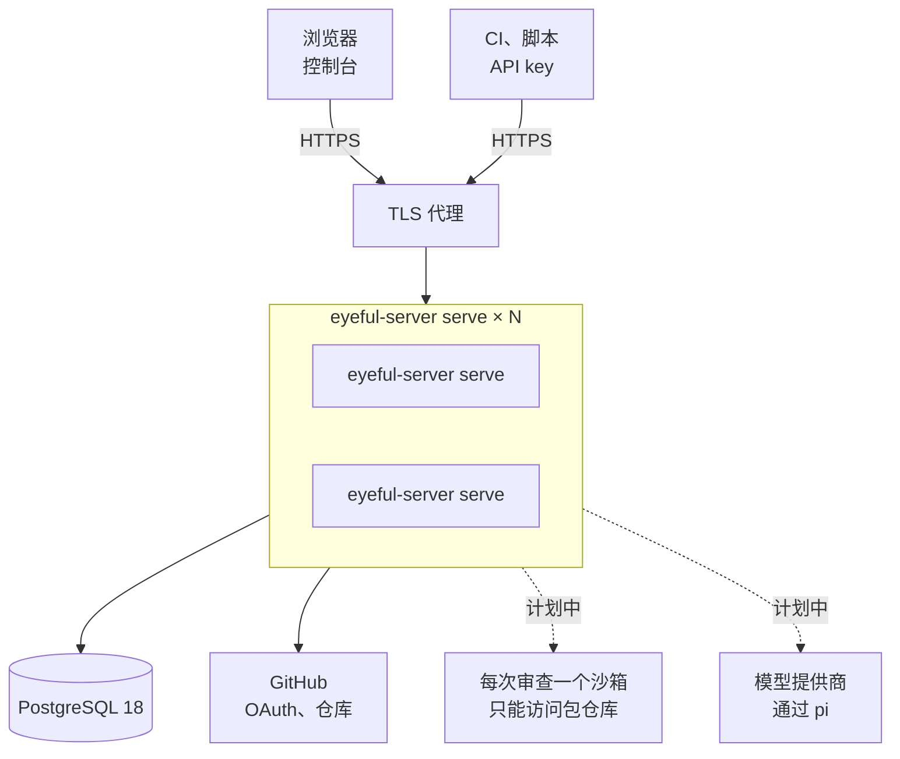
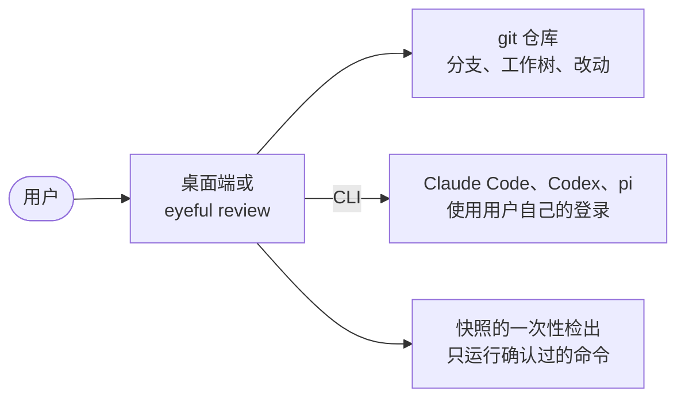

# 部署上线

本页介绍 eyeful 交付哪些产物、各自运行在哪里，以及生产部署需要什么。从源码运行见[本地开发](DEVELOPMENT.md)，全部变量见[配置项参考](CONFIGURATION.md#server)，发布时间见[版本路线图](ROADMAP.md)。

云端部署由这几部分组成：`eyeful-server serve` 二进制文件、一个 PostgreSQL 18 数据库、一个 TLS 代理、一个 GitHub App 和三个密钥。要扩容，就在同一个数据库上多运行几份二进制文件。本地部分是桌面端和 `eyeful` 命令，不需要服务端。任何东西都要先通过 CI 才会发布：`main` 上每次 CI 通过后，文档站点发布到 GitHub Pages（`docs.yml`）；推送 `v*` 标签会先运行 CI，再由 GoReleaser（`release.yml`、`.goreleaser.yml`）把 Linux 和 macOS 的 `eyeful` 命令行以压缩包、`.deb` 和 `.rpm` 的形式附到 GitHub release 上。目前还没有打过版本标签。

## 产物

| 产物                | 构建方式                                       | 运行在                        |
| ------------------- | ---------------------------------------------- | ----------------------------- |
| `bin/eyeful-server` | `mise run build`                               | 服务器，与 PostgreSQL 18 一起 |
| 容器镜像            | `Dockerfile`（distroless，端口 8080）          | 任何容器运行环境              |
| 桌面端              | `mise run package:desktop`（Wails）            | macOS、Windows、Linux         |
| `eyeful`            | `mise run install`，或 `v*` 标签（GoReleaser） | 用户的电脑                    |
| 文档站点            | `mise run build:docs`（VitePress）             | `DOCS_URL` 上的 GitHub Pages  |

二进制文件内嵌了控制台、数据库迁移和 OpenAPI 文档。云端部署就是这一个文件加一个数据库地址，不需要单独托管前端，也不需要单独执行迁移。CI（`.github/workflows/ci.yml`）目前只运行 `mise run check`。

## 云端

用户访问控制台、脚本调用 API，用的是同一个地址。所有 `eyeful-server serve` 进程都一样，代理可以把任何请求发给任何一个。虚线部分是计划中的。在它们实现之前，云端审查会被接收并排队，然后由执行器以失败结束并写明原因（见[数据流](ARCHITECTURE.md#data-flow)）。

### 进程与扩容

每个进程同时提供 API 和控制台，并运行 `--workers` 个工作进程。工作进程从 PostgreSQL 中的队列领取审查，所以扩容就是在同一个数据库上多启动几个进程。这些进程共用一个队列，彼此之间不需要通信（见[任务调度与租约](SCHEDULING.md)）。

限流是个例外。在共享的计数窗口实现之前，每个进程各自计数，所以有多个进程时，实际的限额会乘以进程数。

### 数据库结构

`eyeful-server serve` 启动时会执行尚未应用的迁移，单个进程这样就够了。有多个进程时，先在发布前单独运行一次 `eyeful-server migrate up`，再给每个进程加上 `--no-migrate` 启动，避免它们同时执行迁移。

### TLS 与 cookie

服务端只提供普通 HTTP，由前面的代理负责 TLS。把 `EYEFUL_PUBLIC_URL` 设为对外的 HTTPS 地址，OAuth 回调地址和受信任的源都由它得出。不要设置 `EYEFUL_INSECURE_COOKIES`，这样会话 cookie 会带上 `Secure`。

### GitHub App

登录和读取仓库都通过 GitHub App。注册时回调地址填 `<EYEFUL_PUBLIC_URL>/oauth/github/callback`，权限按[本地开发](DEVELOPMENT.md#commands)中列出的设置。Gitee OAuth 应用是可选的。

### 密钥

有三个值属于密钥，应放在部署平台的密钥管理里：数据库地址、GitHub client secret 和 `EYEFUL_TOKEN_KEY`。token 密钥用来加密每个用户保存的第三方 token，丢失后这些 token 就无法解密，所有用户都要重新登录（见[登录与凭据](AUTH.md)）。

### 健康检查与停止

存活探针用 `GET /health`，就绪探针用 `GET /ready`。停止进程时发送 `SIGTERM`：进程不再接收新请求，并在 `--shutdown-timeout` 内把运行中的审查放回队列，由其他进程接手（见[生命周期](ARCHITECTURE.md#lifecycle)）。

### 在一台机器上试用

`compose.yaml` 可以在本地跑出同样的部署结构：

1. 按[本地开发](DEVELOPMENT.md#setup)填好 `.env`。在仓库目录内，mise 会把它加载到 shell 里。
2. 运行 `docker compose --profile server up`，它会构建镜像，并和 PostgreSQL 一起启动。
3. 打开 `http://localhost:8080`。

compose 文件设置了 `EYEFUL_INSECURE_COOKIES`，让登录能在普通 HTTP 下工作，所以只适合本地使用。

## 本地

本地模式只需要安装应用本身，不需要服务端、数据库、eyeful 账号或模型密钥，因为 agent 就是用户已经登录的编码工具。

`eyeful review` 使用 `eyeful connect` 选定的 agent 进行审查；桌面端在窗口里做同样的事（见[桌面端](LOCAL.md#desktop)）。本地审查允许运行什么、怎样隔离，见[本地运行](LOCAL.md)。
