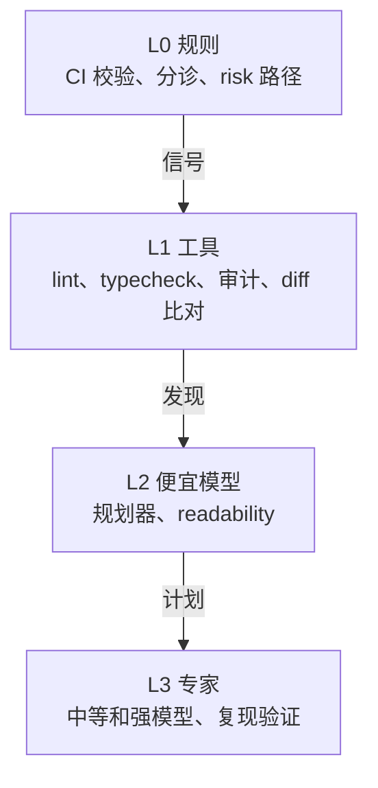

# 档位

一次审查的花费应该和改动的大小相称。为此，eyeful 只在更便宜的检查发现了问题时，才启动相应的 agent：先跑规则，再跑工具，然后是便宜的模型，最后才是专家。每一层只处理上一层标出来的内容，档位决定一次审查最多走到哪一层。档位还决定专家看得多仔细。选档、路由规则和预算都已在 `workflow` 中实现，L1 工具本身还没有实现。

## 四个层级

| 层级 | 运行什么                                                                                              | 模型开销 |
| ---- | ----------------------------------------------------------------------------------------------------- | -------- |
| L0   | CI 校验、分诊、匹配 `risk` 路径和文件类型                                                             | 无       |
| L1   | `lint`、`typecheck`、`secret_scan`、`dependency_audit`、`openapi_diff`、`complexity`、`coverage_diff` | 无       |
| L2   | 规划器、readability 专家、把工具输出写成评论                                                          | 少       |
| L3   | correctness、security、design、tests、usability 专家，以及复现验证                                    | 大部分   |

L0 和 L1 的结果是确定的，也不消耗 token，所以每次审查都会运行。上面几层也是根据它们的输出来行动。

## 各档位运行什么

| 档位     | 总是运行       | 专家                                                | 报告什么                                 | 验证                                     |
| -------- | -------------- | --------------------------------------------------- | ---------------------------------------- | ---------------------------------------- |
| quick    | L0、L1         | 只在 L1 工具发现问题的地方，最多 2 个便宜模型的专家 | 改变行为或破坏契约的问题                 | 不验证                                   |
| standard | L0、L1、规划器 | 由规划器选择                                        | 改变行为或破坏契约的问题                 | 按验证顺序复现，并运行改动涉及的包的测试 |
| deep     | L0、L1、规划器 | 由规划器选择，使用强模型                            | 同上，另外报告命名、风格、措辞和小的简化 | 全部复现，并运行完整测试套件和 E2E       |

quick 档没有规划器，由规则把工具结果分给专家：`secret_scan` 命中交给 security，`typecheck` 报错交给 correctness，`openapi_diff` 发现破坏性变更交给 usability。工具什么都没发现时，quick 审查就只是一份工具结果，不消耗 token。也正因为这样，quick 是唯一不要求每一行都被审查的档位（见[规划与分诊](PLANNER.md#triage)）。

档位表示一次审查看得多仔细，由 eyeful 只根据改动本身决定。standard 和 deep 都由规划器读改动、分组、挑需要的专家（见[审查计划](PLANNER.md#the-plan)），专家数量没有上限。两者的区别在于发现的门槛：standard 档的专家只报告改变行为或破坏契约的问题，即使仍有 `low` 级别的发现，Go 也会把它们去掉，并在反馈里记下数量；deep 档的专家还会把命名、风格、措辞和小的简化作为 `low` 报告出来，使用强模型，验证器也会运行完整的测试套件。两个档位里，专家内部比较重的工具都是用到才跑：`sast`、`e2e_run` 和 `a11y_check` 只在专家调用时运行。

有几种信号在任何档位都会启动专家：

| 信号                       | 效果           |
| -------------------------- | -------------- |
| 新增或升级的依赖有已知 CVE | 运行 security  |
| diff 里出现密钥            | 运行 security  |
| API 文档出现破坏性变更     | 运行 usability |
| 改动涉及 `risk` 路径       | 档位升到 deep  |

## 怎样选档位 {#choosing-the-level}

没有人选择档位，eyeful 根据改动自己决定，就像 revmux 默认只跑一个配置而不是询问用户。改动涉及 `.eyeful/config.yml` 里的 `risk` 路径或 `CODEOWNERS` 中的路径，或者 diff 改动超过 2000 行时用 deep，其余用 standard。规划器表示把握不大时档位上调，不会下调。审查进行中也可以升档，已经跑过的部分可以复用。

每个档位有 token 和费用两项预算，验证器执行的每条命令也各有超时。总时长不设上限，因为项目自己的测试可能比任何固定上限都慢。Go 在启动每个 agent 之前检查预算，所以预算用完时已经在跑的 agent 会跑完；同一时间最多运行四个专家，这限制了它们能超出多少（见[本地运行](LOCAL.md#agents)）。此后审查不再启动新的 agent，返回已经验证的部分，结果为 `partial`。quick 档不会被自动选中；[效果评测](EVALUATION.md)通过 workflow 的请求固定档位，以测量 standard 比 quick 多发现了什么。

## 为什么按需启动

每次改动都把所有专家跑一遍，做法简单，但很费钱。大多数改动只需要两三个专家，而且很多问题 linter 或依赖审计就能发现。只在有信号时启动专家，开销就能和改动的规模大致相当。这样做会不会漏掉问题，由[效果评测](EVALUATION.md#ablations)和“每次运行所有专家”对比来测量。
