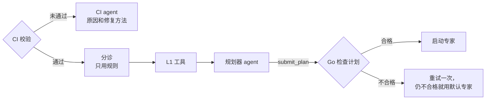

# 规划与分诊

审查的第一个阶段要做三件事：看改动是否到了可以审查的程度，把不需要审查的文件放到一边，再决定剩下的文件由哪些专家来审。这三步按成本从低到高依次进行。本页的步骤和规则都已在 `workflow` 中实现；L1 工具、读取 GitHub 上的 CI 结果、规划器的提示词和 `submit_plan` 工具属于运行时，还没有实现。



## CI 校验 {#ci-check}

如果改动编译不过，或者项目自己的测试没通过，专家找到的问题多半和 CI 报的重复。所以这一阶段先看 CI。

在云端，eyeful 读取 head 提交对应的 GitHub Actions 运行记录。还有运行没结束时，审查先等待；全部通过，或者仓库没有配置 workflow，就继续往下走。

在本地没有 CI 记录可读，由验证器在工作目录里运行 [`.eyeful/config.yml`](CONFIGURATION.md#project) 中的 `lint` 命令和 L1 的 `typecheck`。完整的 `test` 命令只在 deep 档运行，因为有些项目跑一遍全部测试比整个审查还慢。

校验没通过时，不会启动任何专家，只启动 CI agent。它读取失败任务的日志（本地则读命令输出），对每处失败说明是哪个 workflow、job 和 step，原因是什么，怎么修。审查以 `ci_failed` 结束。CI 通过时这一步没有额外开销，不通过时只多跑一次 agent。

## 分诊 {#triage}

分诊只用规则给改动的文件分类，不调用模型。通过 glob 匹配找出锁文件、生成代码、第三方代码、二进制文件，以及 `.eyeful/config.yml` 里 `skip` 列出的路径；另有一条大小规则，把 diff 超过 512 KB 的文件放到一边。这些文件不交给专家，在反馈里列为“未审查”。参照 Google 的 [Every Line](https://google.github.io/eng-practices/review/reviewer/looking-for.html#every-line)，其余每一行都至少要交给一个专家。quick 档例外，只审查被工具标出的行（见[档位](LEVELS.md)）。

剩下的文件整理成一份清单，每个文件一行：

```text
path                      class   +lines  -lines
app/auth/session.py       code        12       3
app/auth/test_session.py  test         0       0
web/src/Login.svelte      code        40      18
package-lock.json         lock       310     120
commits: "fix session expiry at the boundary", "show the expiry on the login page"
```

分诊还会按项目用到的语言运行 L1 工具（`lint`、`typecheck`、`secret_scan`、`dependency_audit`、`openapi_diff`、`complexity`、`coverage_diff`），把结果附在清单后面。这些工具不消耗 token，规划器就根据它们的结果做判断（见[档位](LEVELS.md)）。

## 大改动 {#large}

分诊保留下来的文件改动超过 2000 行时，先拆成若干范围，再做任何规划。这借鉴了 pulls.review 一次只审一个范围的做法。拆分由 Go 只根据路径完成，不调用模型，所以同样的改动总是得到同样的范围，云端和本地都一样：

1. 文件按路径排序，先按第一级目录分组，再按前两级目录分组。两级之后仍超过 2000 行的组，按路径顺序切成每份不超过 2000 行的几部分；单个文件本身就更大时，自成一部分。
2. 相邻的组在合计不超过 2000 行的前提下合并，避免出现几乎空的范围。
3. 每个范围按顺序单独规划、单独分配专家，清单只包含这个范围的文件。规划器看到的清单从不超过一个范围，Go 也按各自的范围检查每份计划。
4. 每个范围最多花掉审查预算的平均一份。某个范围用完自己那份后不再启动 agent，审查结果为 `partial`，后面的范围照常运行。

档位对整个改动只选一次（见[档位的选择](LEVELS.md#choosing-the-level)），验证和汇总也只对所有范围的发现运行一次。报告按顺序列出这些范围，作者可以据此把改动拆成一组 stacked 改动（见[排序报告](REPORT.md#ranked-report)）；eyeful 从不创建分支或 pull request。

## 审查计划 {#the-plan}

quick 档没有规划器，由规则把每条工具结果分给对应的专家。standard 和 deep 档的规划器先弄清这次改动干了什么，做法和 pulls.review 先读完 pull request 再拆分一样。它读所有保留文件的 diff（改动很大时有些 diff 会省略，规划器需要时用 `git_diff` 打开）、文件清单、提交说明和工具结果，然后为没看过这次改动的人写一段概述。

接着它按意图分组，让同一组的文件放在一起理解。每组标明触及系统的哪一部分（`category`，沿用 pulls.review 的类别：`ui`、`api`、`core`、`data`、`cli`、`security`、`tests`、`docs`、`examples`、`deps`、`build`、`scripts`、`config`、`i18n`、`assets`、`other`），用一句话说明这些文件为什么改，并标明是否属于核心（`core`）：认证和权限、密钥、并发和加锁、数据和迁移、公开 API 或契约、模块的主逻辑，这些地方出错代价最大。核心组排在前面。分组里有 `.eyeful/config.yml` 中 `risk` 路径的，Go 也会把它标为核心。

最后规划器给每组挑专家。被选中的专家只运行一次，在这一次里审查分给它的所有组。所以只改一行的配置或者一处文档，应该交给已经在审查别的组的专家，不必为它单独启动一个专家。分组决定专家读什么、在哪里看得最仔细，不决定运行多少个 agent。规划器通过 `submit_plan` 提交计划，这个工具的 schema 里写了规则。下面是一个例子，schema 还没有定稿：

```json
{
	"summary": "Sessions are now treated as expired at the exact expiry second, and the login page shows when a session ends.",
	"groups": [
		{
			"category": "security",
			"summary": "A session was still accepted at the second it expired",
			"core": true,
			"files": ["app/auth/session.py"],
			"experts": [
				{ "name": "correctness", "why": "boundary condition in is_expired" },
				{ "name": "security", "why": "session validity decides access" }
			]
		},
		{
			"category": "ui",
			"summary": "Show users when their session ends",
			"core": false,
			"files": ["web/src/Login.svelte"],
			"experts": [{ "name": "correctness", "why": "already reviewing the session change" }]
		}
	],
	"skipped": [{ "name": "usability", "why": "one line of text on the login page" }],
	"confidence": 0.8
}
```

规划器的提示词里附有下面这张常见搭配表，仅供参考，规划器可以不照做：

| 改动内容               | 通常需要                      |
| ---------------------- | ----------------------------- |
| 只改了文档或注释       | readability                   |
| 新增模块、依赖或分层   | design、tests                 |
| 登录、认证、权限       | correctness、security、tests  |
| 前端组件、用户操作流程 | usability、readability、tests |
| 数据库迁移、数据处理   | correctness、security         |
| 公开 API 的签名        | design、usability             |
| 并发、加锁、重试       | correctness、design           |

## Go 怎样检查计划

计划只是一份数据，要 Go 认可才会执行。出现以下情况时，Go 拒绝这份计划：

- 分诊保留下来的某个文件不属于任何分组；
- 某个分组没有专家；
- 某个分组里有分诊没有保留的文件；
- 专家名字不在[专家名单](EXPERTS.md#the-roster)里，或者在同一分组里出现两次；
- 某个分组的类别不在上面的列表里；
- 计划没有写改动概述；
- 把握不在 0 到 1 之间。

被拒的计划会连同原因退回给规划器重做一次。第二次还不合格，或者规划器连续两次出错，就使用该档位的默认专家：所有保留下来的文件放在一个分组里，取名单里的前四个专家，并在反馈里说明。计划给出的把握低于 0.5 时，档位上调一级。之后 Go 再补上信号要求的专家（见[档位](LEVELS.md)），启动专家并分配预算，这些规划器都管不了。
