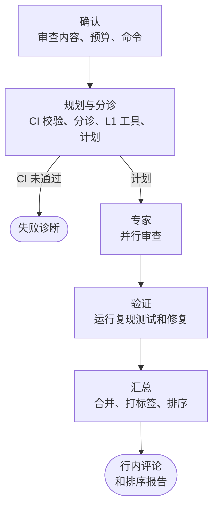

# 一次审查的全过程

本页从用户确认开始，按顺序介绍一次审查，直到有人读到评审意见。各个阶段已经在 `workflow` 模块中实现（见[整体架构](ARCHITECTURE.md#workflow)），但还没有审查真正用到它：API 能接收审查，工作进程也会领取，随后一个占位执行器以 `none` 结束它，因为 `workflow` 需要的 agent 和沙箱还没有。

## 开始之前 {#before-it-starts}

创建审查前，客户端会列出要审查的内容（某个分支相对基础分支的改动，或本地改动）、预算，以及会执行哪些项目命令，用户确认后才创建；档位由 eyeful 自己选择（见[档位](LEVELS.md#choosing-the-level)）。审查开始后不能取消，只有还在排队时可以删除。

项目命令写在 `.eyeful/config.yml` 里。本地运行时，命令改过之后要重新确认。仓库里没有这个文件时不运行任何命令，所有发现都保持未验证；由 agent 推测命令、再交给用户确认的做法还在计划中。

## 各个阶段 {#stages}

| 阶段      | 做什么                                            | 出错时                         | 详见                          |
| --------- | ------------------------------------------------- | ------------------------------ | ----------------------------- |
| planning  | CI 校验，检出代码并安装依赖，分诊和 L1 工具，计划 | 见下文                         | [规划与分诊](PLANNER.md)      |
| experts   | 每个选中的专家按自己的标准和工具审查分到的文件    | 去掉这个专家，在反馈里标为缺席 | [专家](EXPERTS.md)            |
| verify    | 验证器运行复现测试和修复建议                      | 这条发现保持未验证             | [证据与验证](VERIFICATION.md) |
| summarize | 合并发现，写成 Conventional Comments 并排序       | 改用规则来排版                 | [审查反馈](REPORT.md)         |

某个阶段出错时，只丢掉这个阶段的结果，并在反馈里注明。整个审查提前结束只有两种情况：CI 校验没通过，审查以 `ci_failed` 结束并附上诊断；仓库克隆失败，以 `none` 结束。依赖装不上不会结束审查，专家照常审查，只是所有发现都标为未验证（见[证据与验证](VERIFICATION.md#the-verifier)）。

每个阶段结束时，都会把产出（计划、各专家的发现、每次验证）写入运行归档。工作进程中途退出时，接手的进程从最后一个完成的阶段继续，已经完成的模型调用不会重复执行。

一次审查能用几个专家、用哪些模型、验证多少条，由档位决定（见[档位](LEVELS.md)）。

## 评审标准 {#review-standard}

eyeful 参考 Google 的 [Standard of Code Review](https://google.github.io/eng-practices/review/reviewer/standard.html)。eyeful 不批准任何改动，所以只采用其中关于如何提意见的部分。

只有能说明改动引入了 bug、漏洞或回归的意见才是阻塞的；“还可以写得更好”这类意见都是非阻塞的建议。有测试运行结果支撑的发现，排在只有论证的发现前面。代码风格以项目自己的风格指南为准，指南里没提到的风格问题只能标为 `nitpick`。设计方面的意见要写明依据哪条工程原则。专家看到明显的改进时，可以用 `praise` 指出来。

这些规则怎样对应到评论标签，见[审查反馈](REPORT.md)；出处见[参考文献](REFERENCES.md)。

## 状态与结果

审查依次经过 `queued`、`running`、`done` 三个状态。结束的审查有以下几种结果：

| 结果        | 含义                                              |
| ----------- | ------------------------------------------------- |
| `complete`  | 所有阶段都运行了                                  |
| `none`      | 没有可审查的内容，`reason` 写明原因，比如克隆失败 |
| `ci_failed` | CI 校验没通过，反馈只说明失败原因                 |
| `partial`   | 预算用完，反馈包含此前已验证的部分                |

工作进程怎样领取、续约和结束审查，进程挂掉时会怎样，见[任务调度与租约](SCHEDULING.md#reviews-over-workers)。

## 审查规则 {#rules}

评论该怎么写，由上面取自文献的评审标准决定；下面的规则决定流程怎么运行，其中几条对应 `.agents/POLARIS.md` 里的硬性指标。

1. agent 决定做什么，Go 决定允不允许，所有循环、预算和停止条件都由 Go 控制。
2. 规划器表示把握不大时，档位往上调，不往下调。
3. eyeful 不批准改动，也不拦截合并，合并由人来做。
4. 每次运行都有记录：谁运行的、运行了什么、花了多少。这些记录也是论文的数据。
5. 复审时拿到上一轮的发现，但拿不到上一轮的推理过程。
6. 审查开始前要用户确认，开始后一直运行到结束。
7. CI 没通过的改动只做失败诊断，不做审查。

## 待定事项 {#open-decisions}

- 结论怎么给：每个专家对自己负责的部分给出总体结论，还是只由汇总阶段按证据强度决定哪些问题阻塞？
- 覆盖率：“覆盖率不能下降”作为硬性规则，还是作为 tests 专家的一条普通发现？
