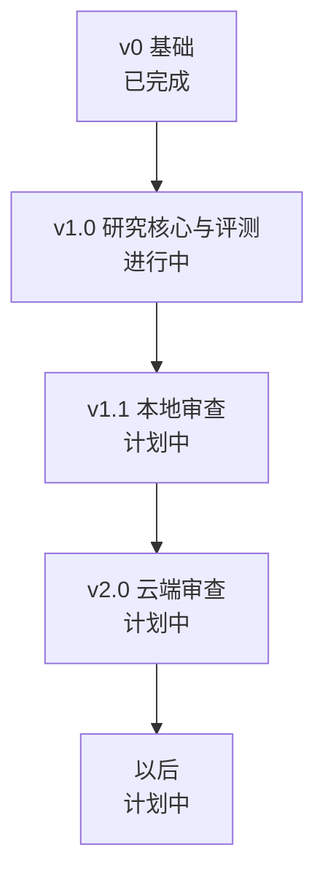

# 版本路线图

本页列出每个版本做什么，以及发布前要满足哪些条件。其他文档描述设计并注明哪些未实现，这一篇给这些工作排顺序。一个版本只有在满足退出条件、并且 `.agents/POLARIS.md` 中的硬性指标都没有退步时才发布。

论文的核心问题是：执行验证能不能去掉误报（见[研究问题](EVALUATION.md#research-question)）。所以下一个版本只做回答这个问题所需要的部分，并完成实验；本地和云端客户端等有了数据之后再做。

## v0：基础（已完成）

v0 是后续版本的基础，已经全部在仓库里：GitHub App 和 Gitee 登录、API key 和加密保存的第三方 token（见[登录与凭据](AUTH.md)）；CRUD API、OpenAPI 文档和 TypeScript SDK（见[API 约定](API.md)）；带租约、fencing 和回收的 PostgreSQL 队列，以及已经写好但还没接入的模型路由（见[任务调度与租约](SCHEDULING.md)）；控制台的仓库浏览；能列出本地改动的桌面窗口；运行 `mise run check` 的 CI。这些内容和研究问题关系不大，所以 v1.0 收窄了范围。

## v1.0：研究核心与评测（进行中）

v1.0 只包含实验需要的部分，通过命令行对数据集运行：

- `workflow` 模块：规划与分诊、专家、验证器和汇总（见[各个阶段](REVIEW.md#stages)）。CI 校验简化为运行数据集自带的测试。
- 发现可以复现的两个专家：correctness 和 security，以及它们的 skill、工具和检查清单（见[专家](EXPERTS.md)）。
- 带判定依据规则的验证器（见[证据与验证](VERIFICATION.md)），以及作为对照条件的只读评判 agent。
- agent 只在 pi 中运行，使用 eyeful 管理的模型密钥，每个 token 都能计数（见[在 pi 中运行 agent](CLOUD.md#agents-in-pi)）。
- 样本在 SWE-bench 自带的 Docker 环境中运行，注入 bug 集使用容器运行。
- 运行归档，保存论文中报告的所有数字，以及各阶段的检查点。
- quick 和 standard 两个档位，反馈输出为 SARIF 和 Markdown。
- `eval/`：数据集、三种实验条件、标注流程和消融实验（见[效果评测](EVALUATION.md)）。

退出条件：

- 主实验已在两个 bug 数据集、三种条件下跑完，发现已按效果评测中的要求标注。
- 这些运行中的每条 `issue (blocking)` 都经验证器确认失败过，判定依据为 `implicit`、`existing` 或 `spec`。
- 预算用完的审查能返回已验证的部分，并标为 partial；审查中途被杀掉的工作进程能从最后完成的阶段继续。
- 论文能说明 standard 相比 quick 多得到了什么，这是 v1.0 衡量“花费与改动相称”的方式。

v1.0 发布之前，控制台、桌面端、Gitee 登录、CORS、限流和 MCP 不加新功能，但保持可用，测试照常保留。

## v1.1：本地审查（计划中）

v1.1 在用户电脑上运行同一套流程（见[本地运行](LOCAL.md)）。新增 `local/agents`，用来运行用户自己的编码 agent 命令行，不使用 MCP；快照及项目命令用的一次性检出；`eyeful review` 和桌面端在用户确认后发起审查；补上 v1.0 没做的专家（design、tests、usability、readability）。数据库迁移从直接修改 `0001_init` 改为每次变更一个文件（见[数据库与迁移](PERSISTENCE.md)）。

其中一部分已经先于 v1.0 完成，因为有了它，实验用的专家和验证器可以在真实改动上试用：不使用 MCP 的 `local/agents`、快照及其检出、六个专家及来自 skills.sh 的 skill，`eyeful review`、`provider` 和 `connect`，以及能做同样事情的桌面端。

退出条件：在 eyeful 自己的仓库上运行 `eyeful review` 能得到反馈，期间不访问服务端，也没有任何凭据或模型密钥离开本机。

## v2.0：云端审查（计划中）

v2.0 对 pull request 运行这套流程（见[云端运行](CLOUD.md)）。新增基于 GitHub Actions 的 CI 校验；`internal/checkout` 和 `internal/sandbox`，每次审查一个不含凭据的沙箱；source、outbox 和 sink；以 `COMMENT` review 发布评论，以及可选的 Check Run；deep 档，包括完整测试套件和 E2E；SSE 进度推送；`runner` 命令。

退出条件：对不受信任的 pull request 做云端审查时，代码只在它的沙箱里运行；审查途中杀掉工作进程，不丢失任何东西，也不会重复执行。

## 以后（计划中）

`POST /mcp` 上的 MCP 接口（见 [API 约定](API.md#mcp-planned)）、webhook 和定时触发、性能方面的专家、团队共享审查。
