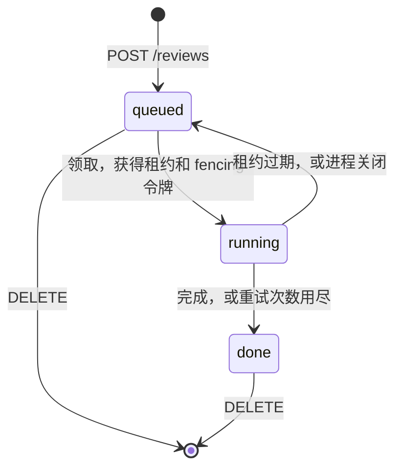

# 任务调度与租约

调度分两层。审查分配给工作进程，由 `internal/scheduler` 负责，已经在运行。agent 的每次运行分配给模型提供商，由 `internal/dispatch` 负责，已经写好并测试过，等 pi 运行环境就绪后接入。两层都遵循同样的做法：出错只影响出错的那一部分，每个决定都记录原因。

## 审查分配给工作进程 {#reviews-over-workers}



| 机制 | 行为                                                                              |
| ---- | --------------------------------------------------------------------------------- |
| 准入 | 用同一个 `Idempotency-Key` 重复请求时返回第一次创建的审查；请求体不同则返回 `409` |
| 领取 | 对最早排队的审查执行 `SELECT … FOR UPDATE SKIP LOCKED`；令牌取自一个数据库序列    |
| 续约 | 每隔 `--lease-ttl` 的三分之一续约一次；临时错误在下一次续约时重试                 |
| 隔离 | 用过期令牌调用 `Renew`、`Finish`、`Release` 会返回 `ErrFenced`                    |
| 完成 | 执行器返回错误时，结果为 `none`，错误信息写入原因；没有错误则为 `complete`        |
| 回收 | 租约过期的审查回到队列；超过 `--max-attempts` 次后设为 `done`，结果为 `none`      |
| 删除 | 只能删除排队中或已完成的审查，用一条语句完成，删除和领取不可能同时成功            |
| 关闭 | 运行中的审查释放回队列，不计入重试次数                                            |
| 容量 | 每个进程运行 `--workers` 个工作进程；要扩容就在同一个数据库上多开进程             |

服务端使用 `review.PostgresStore`；`reviewtest.MemoryStore` 实现同样的接口约定，供测试使用（见[数据库与迁移](PERSISTENCE.md#tests)）。

## agent 运行分配给模型提供商 {#agent-runs-over-providers}

agent 只指定档次（`cheap`、`mid` 或 `strong`）。每个档次是一组候选，每个密钥一项：

```yaml
strong:
  - { model: anthropic/claude-sonnet-5-5, priority: 0, weight: 3 }
  - { model: openrouter/anthropic/claude-sonnet-5-5, priority: 0, weight: 1 }
  - { model: deepseek/deepseek-v4, priority: 1 }
```

| 机制     | 行为                                                                                      |
| -------- | ----------------------------------------------------------------------------------------- |
| 选择     | 先选可用的最低优先级，同一优先级内按权重随机；每次重试降一级优先级                        |
| 决定     | `Decide` 返回重试或停止，并附原因，如 `output_committed`、`non_retryable`                 |
| 冷却     | 余额不足：30 分钟。配额用尽：到配额重置。限流：按 `Retry-After`。其他：1 分钟起，每次翻倍 |
| 提交点   | agent 一旦报告过任何内容，之后再出错就直接算失败，不再换模型                              |
| 并发通道 | 每个密钥有 `max_concurrency` 上限，超出的请求按先进先出排队；排队不会触发换模型或冷却     |

计划中：同一次审查中每个角色固定使用同一个候选、模型提供商错误的分类。按档位的预算由 `workflow` 管理（见[档位](LEVELS.md#choosing-the-level)）。

## 限流 {#rate-limits}

按客户端 IP 使用固定时间窗口计数，超出时返回 `429 rate_limited` 和 `Retry-After`。`--rate-limit` 作用于所有 API 路由（默认每分钟 600 次），`--critical-rate-limit` 作用于注册、登录和创建审查（默认每分钟 30 次）。计数保存在内存中；多台服务器共享的 Redis 计数窗口计划中。

## 尚未完成

- 只负责领取和执行审查的 `runner` 命令。
- 续约失败超过 TTL 后自行停止的工作进程。在那之前，失去连接的工作进程可能和接替它的进程同时运行；fencing 会丢弃它的结果，但它已经花掉的模型费用收不回来。
- 运行档案。`workflow` 已经通过 `Archive` 接口保存每个阶段的输出，并跳过档案里已有的阶段（见[整体架构](ARCHITECTURE.md#workflow)），但还没有实现存储，所以被重新领取的审查还不能从最后完成的阶段继续。
- 重试失败的 `Finish`、SSE 进度推送、运行中的审查升档。
