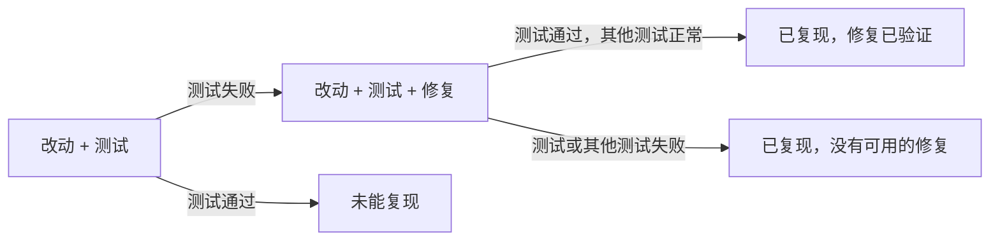

# 证据与验证

本页说明 eyeful 怎样判断一条发现有多可信。专家读代码、调用工具、提出测试；验证器是 `workflow` 里的一段普通 Go 代码，负责运行这些测试并记录结果。测试要通过审查的工作区来运行，工作区还没有实现。

## 测试预言问题 {#oracle}

测试失败只能说明代码和测试对不上，说明不了测试本身是对的。如果专家误解了代码应有的行为，它会按自己的理解写一个失败的测试，再写一个让测试通过的修复，两步都能成功。会话应该在 `expires_at` 那一秒过期还是晚一秒过期，要看需求怎么规定，代码本身回答不了。软件测试里把这称为测试预言问题（oracle problem）。

所以，只有当测试所期望的行为有 agent 以外的来源时，复现才算强证据。每个复现测试都要声明它的判定依据（oracle），也就是期望行为从哪里来，验证器会把它记录下来：

| 判定依据   | 期望行为的来源                                                            | 强度 |
| ---------- | ------------------------------------------------------------------------- | ---- |
| `implicit` | 不需要规格：崩溃、未处理的错误、数据竞争（`-race`）、sanitizer 报告、超时 | 强   |
| `existing` | 仓库里原有的测试，现在失败了                                              | 强   |
| `spec`     | 发现里引用的原文：issue、pull request 描述、文档、docstring、API schema   | 强   |
| `base`     | 基础提交上的行为不同，但这可能正是改动想要的                              | 中   |
| `agent`    | 只有专家自己对代码的理解                                                  | 弱   |

判定依据是 `base` 或 `agent` 的发现不能作为阻塞问题，它的复现会变成一个向作者提出的 `question`，并附上失败的测试。修复建议由另一个 agent 来写，它能看到发现和测试，看不到专家的推理过程，免得修复只是把专家的假设又写了一遍。

## 证据类型 {#evidence-kinds}

| 类型           | 由谁产生                      | 运行了什么                                                         | 强度           |
| -------------- | ----------------------------- | ------------------------------------------------------------------ | -------------- |
| `repro_test`   | correctness、security         | 一个在改动上失败的测试                                             | 取决于判定依据 |
| `cve`          | security                      | `dependency_audit` 或 `cve_lookup` 命中了已知漏洞公告              | 强             |
| `api_break`    | usability                     | `openapi_diff` 发现了破坏性变更                                    | 强             |
| `coverage`     | tests                         | 覆盖率命令，结果和 diff 逐行对照                                   | 强             |
| `tool`         | 任意专家                      | 其他工具：`sast`、`secret_scan`、`typecheck`、`lint`、`a11y_check` | 中             |
| `e2e`          | usability                     | 项目的 E2E 命令，附截图                                            | 中             |
| `trigger_path` | security                      | 没有运行，专家描述问题怎样被触发                                   | 中             |
| `argument`     | design、readability、任意专家 | 没有运行，专家引用代码或标准来论证                                 | 弱             |

有时专家提出了复现测试，但因为档位不允许、预算用完或项目装不起来而没有运行。这时发现保留较弱的证据类型，并标为未验证。

## 测试用来证明发现

eyeful 不会为了提高覆盖率去写测试。测试是专家证明功能错误存在的方式：专家判断正确的话，一个小测试就会在改动上失败。这个测试属于这条发现，只会和它所证明的修复一起交给作者。

## 验证器 {#the-verifier}

eyeful 中只有验证器会运行项目代码，而且只运行 [`.eyeful/config.yml`](CONFIGURATION.md#project) 里的命令和 eyeful 自己的工具。

证据强度要验证之后才知道，所以验证顺序不能依赖它。验证器先处理判定依据为 `implicit`、`existing` 或 `spec` 的测试，再按专家声明的严重程度排，然后按有几个专家报告了同样的行来排。验证多少条由档位决定（见[档位](LEVELS.md)）。

对于带复现测试的发现，验证器依次：

1. 复制一份改动的代码，加入测试并运行，测试必须失败；
2. 在另一份加了测试的新副本上应用修复，再运行一次，测试必须通过；
3. 在这份副本上运行改动涉及的包的测试。deep 档改为运行完整测试套件，按构建、单元、集成、E2E 的顺序，遇到第一个失败就停。原来通过的测试不能变成失败。



复现成功的发现，强度就是它判定依据的强度。测试在改动上就能通过的发现不会生成评论，而是作为已排除的发现列进不自信清单。

这一切的前提是项目能装起来、测试能跑起来，这也是这种方法在实际中最大的限制：很多仓库需要数据库之类的服务，或者不止一条安装命令。`setup` 失败时，审查改为只读审查继续进行，所有发现标为未验证，反馈里说明原因。

## 一个例子

审查 `app/auth/session.py` 的 correctness 专家提出了这个测试：

```python
from app.auth.session import Session, is_expired

def test_expired_at_exact_boundary():
    assert is_expired(Session(expires_at=100), now=100)
```

负责修复的 agent 给出：

```python
def is_expired(session, now):
    return now > session.expires_at  # [!code --]
    return now >= session.expires_at  # [!code ++]
```

测试在改动上失败，加上修复后通过。这条发现算不算强证据，要看判定依据。如果 pull request 里写了“会话在 `expires_at` 时过期”，判定依据是 `spec`，这条发现就成为附带修复的 `issue (blocking)`。如果没有任何地方说明边界该怎么算，判定依据是 `agent`，同一个测试就变成一个 `question`：“会话在正好 `expires_at` 时是否还应有效？这个测试在改动上失败。”结果由验证器写入，专家不能把自己的测试标为通过。

## 用 SARIF 保存发现 {#sarif}

所有发现，不管来自哪里，都以 [SARIF 2.1.0](https://docs.oasis-open.org/sarif/sarif/v2.1.0/sarif-v2.1.0.html) 的 result 保存。SARIF 是 OASIS 制定的静态分析结果格式。Semgrep、gitleaks 这类本来就输出 SARIF 的工具，结果直接读取；专家调用 `submit_report` 提交的内容会转换成同样的结构。标准字段按标准的定义使用，eyeful 自己的字段放在 `properties` 里：

| SARIF 字段       | 内容                                                                     |
| ---------------- | ------------------------------------------------------------------------ |
| `ruleId`、`taxa` | 规则或工具检查项，有 CWE 编号时一并记录                                  |
| `level`          | 阻塞的 `issue` 为 `error`，其他 issue 为 `warning`，其余为 `note`        |
| `kind`           | 验证器复现后为 `fail`，还需要人判断时为 `review`                         |
| `message`        | 评论的标题和正文                                                         |
| `locations`      | 文件和行号                                                               |
| `codeFlows`      | 安全问题的触发路径，逐步列出                                             |
| `fixes`          | 修复建议，以文件改动的形式                                               |
| `properties`     | `expert`、`evidence`、`oracle`、`label`、`decorations`、`corroboratedBy` |

上面例子里的发现，以 pull request 描述作为判定依据：

```json
{
	"ruleId": "eyeful/correctness/boundary",
	"level": "error",
	"kind": "fail",
	"message": { "text": "A session is still valid at exactly expires_at." },
	"locations": [
		{
			"physicalLocation": {
				"artifactLocation": { "uri": "app/auth/session.py" },
				"region": { "startLine": 11 }
			}
		}
	],
	"fixes": [
		{
			"description": { "text": "Treat the expiry second as expired" },
			"artifactChanges": [
				{
					"artifactLocation": { "uri": "app/auth/session.py" },
					"replacements": [
						{
							"deletedRegion": { "startLine": 11, "endLine": 11 },
							"insertedContent": { "text": "    return now >= session.expires_at\n" }
						}
					]
				}
			]
		}
	],
	"properties": {
		"expert": "correctness",
		"evidence": "repro_test",
		"oracle": "spec",
		"label": "issue",
		"decorations": ["blocking", "correctness"],
		"corroboratedBy": ["security"]
	}
}
```

同一份 SARIF 文件可以用来生成评审意见、上传到 GitHub code scanning，也直接用于[效果评测](EVALUATION.md)。

## 与 CI 的关系

eyeful 没有运行的测试套件，仍以项目自己的 CI 结果为准。在云端，[CI 校验](PLANNER.md#ci-check)在审查开始前就已经要求它们全部通过。
